# Analyse UML et diagrammes d'architecture

## Statut

Ces diagrammes remplacent l'UML simplifie initial.
Ils combinent :

- les preuves du `HEAD` legacy ;
- les anciens diagrammes d'arbitrage dans `HEAD:docs/admin-arbitrage/05-diagrammes.md` ;
- les contraintes produit donnees par l'utilisateur ;
- les limites de `v0.1` : pas d'implementation metier ajoutee pendant cette mission.

Chaque diagramme repond a une question precise.

## 1. Contexte systeme

Question : quels acteurs et systemes externes entourent la plateforme ?

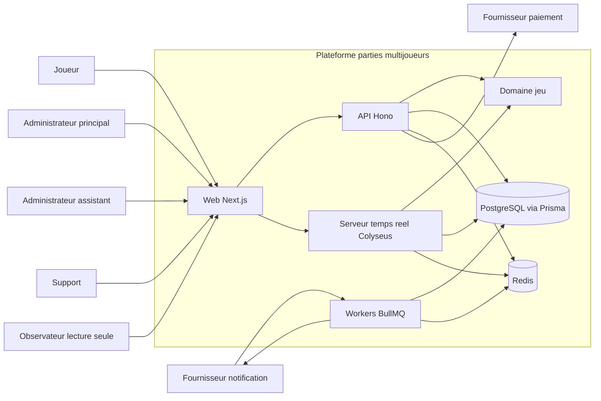

Decision : garder le monorepo et les runtimes actuels ; ne pas ajouter microservices tant que les limites
de responsabilite ne sont pas restaurees.

## 2. Packages et dependances cible

Question : quelles dependances sont autorisees entre modules ?

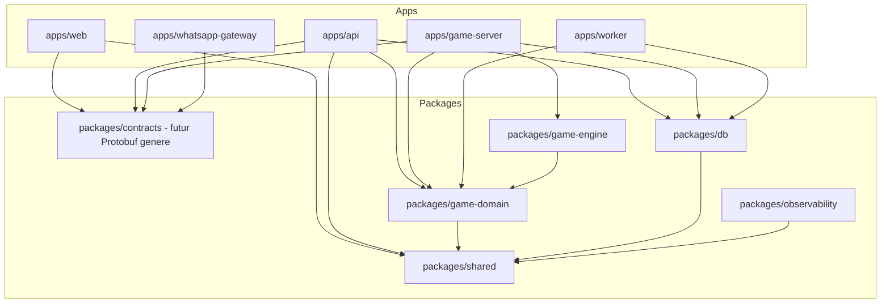

Interdictions :

- `apps/web` ne depend jamais de `packages/db`.
- `packages/game-engine` ne depend jamais de Hono, Next, Prisma ou Colyseus.
- `packages/db` n'exporte pas les entites Prisma comme contrats reseau.
- `apps/game-server` ne contient pas les workflows admin complets.

## 3. Domain model cible

Question : quels concepts doivent etre distincts ?

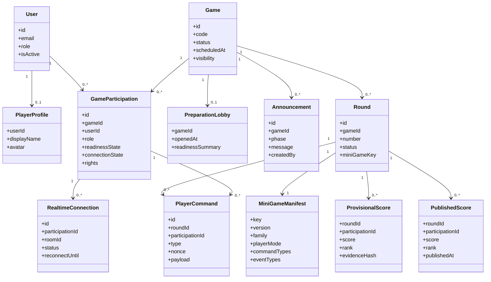

Decision : `GameParticipation` est le pivot manquant du legacy. Elle separe inscription, droits,
presence, etat joueur et observation.

## 4. Machine d'etat d'une partie

Question : quelles transitions sont autorisees et qui peut les declencher ?

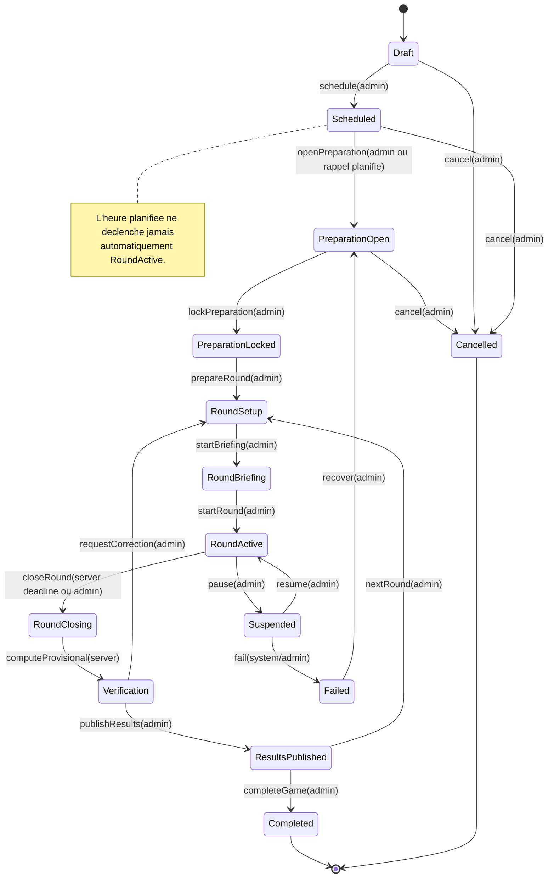

Transition interdite :

- `Scheduled -> RoundActive` par timer.
- `PreparationOpen -> RoundActive` sans action admin.
- `RoundClosing -> ResultsPublished` sans verification explicite.

## 5. Machine d'etat d'une participation

Question : comment suivre un joueur rattache explicitement a une partie ?

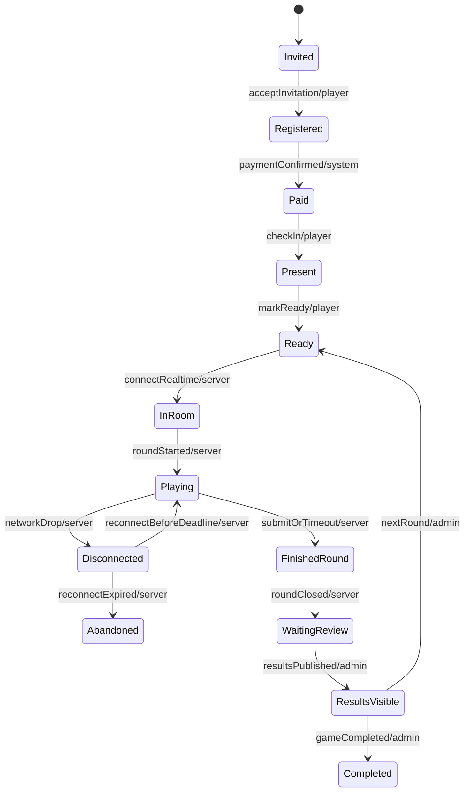

Decision : les etats de paiement, preparation, connexion et round ne doivent pas etre ecrases dans un
unique enum d'inscription.

## 6. Sequence preparation et annonce admin

Question : comment l'administration gere l'avant-match ?

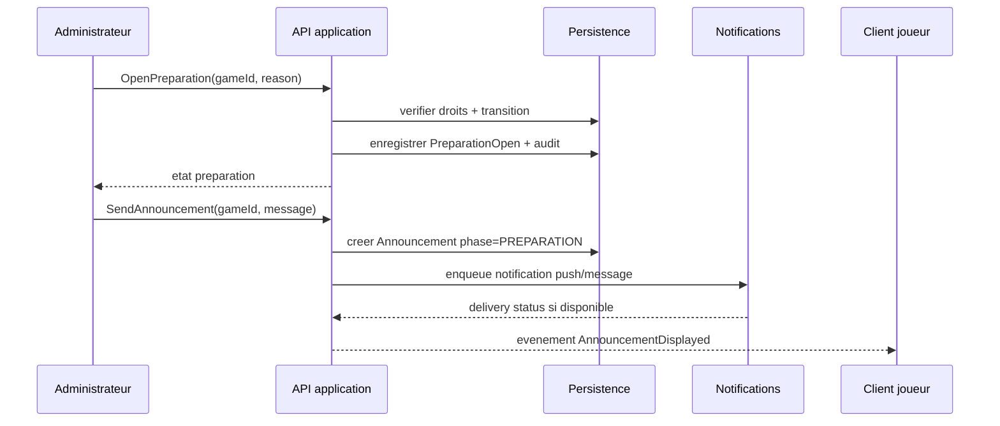

Regle : l'annonce de preparation n'apparait pas dans la selection mini-jeu active.

## 7. Sequence lancement manuel de manche

Question : comment empecher le timer de demarrer seul ?

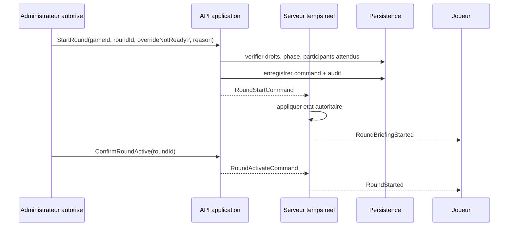

Decision : le serveur peut compter le temps d'une manche active, mais ne choisit pas seul le passage
en manche active.

## 8. Sequence commande joueur et score provisoire

Question : ou sont validees les actions competitives ?

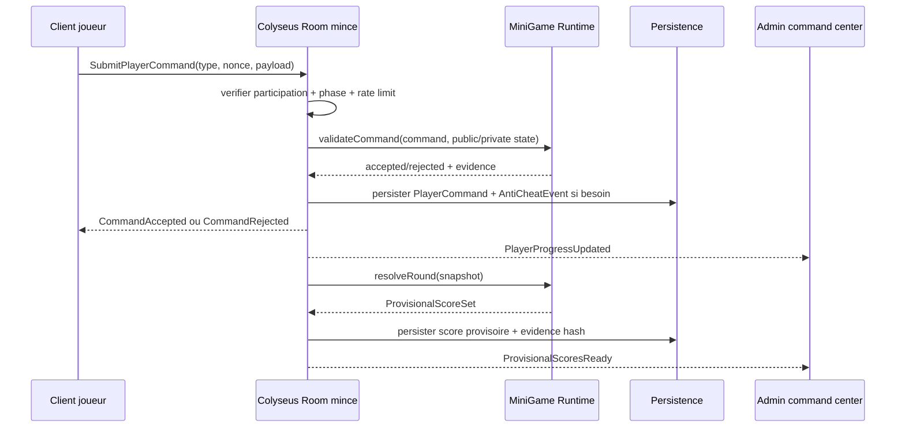

Regle : les scores critiques ne viennent jamais directement du client.

## 9. Sequence fin de manche joueur

Question : que doit voir le joueur apres avoir termine ?

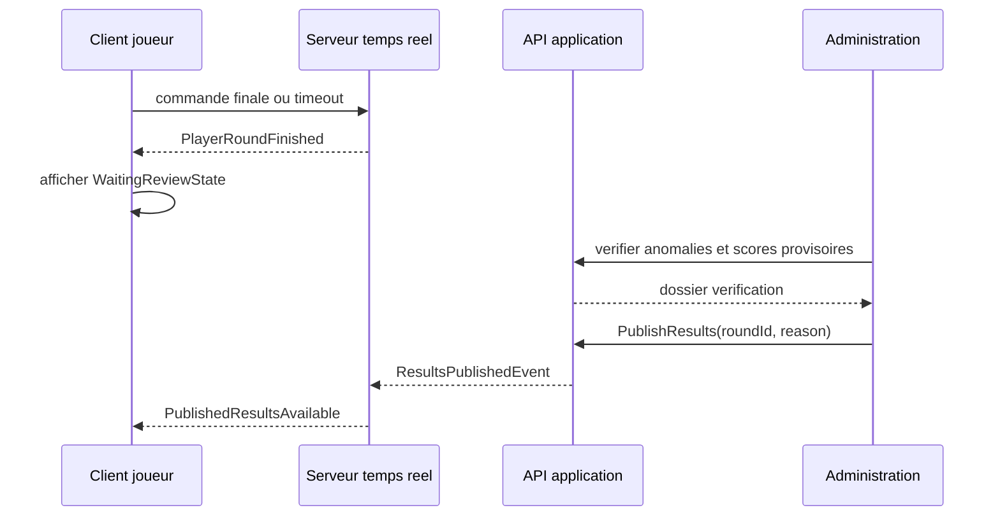

Le joueur ne recoit pas les scores definitifs avant `PublishResults`.

## 10. Sequence observation lecture seule

Question : comment observer sans controler le joueur ?

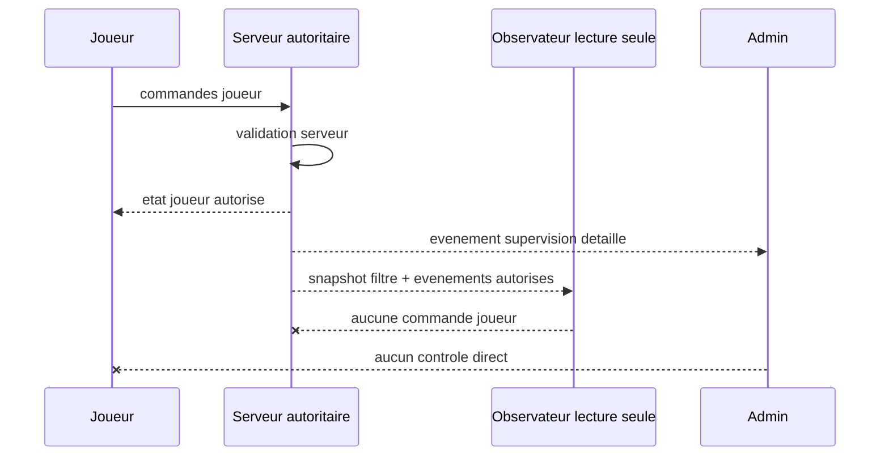

Decision : rendu distant par snapshots/evenements. Pas de capture video sauvegardee en premiere version.

## 11. Sequence verification et publication

Question : comment separer score provisoire et score publie ?

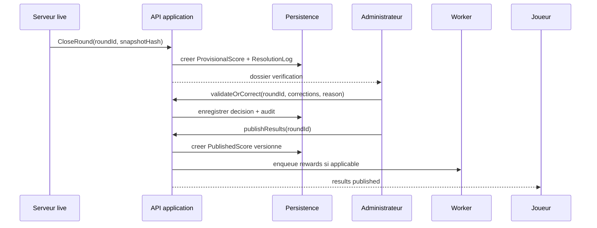

Regle : une correction admin doit etre auditee et liee a une regle documentee.

## 12. Flux de donnees temps reel cible

Question : quels messages doivent etre contractes ?

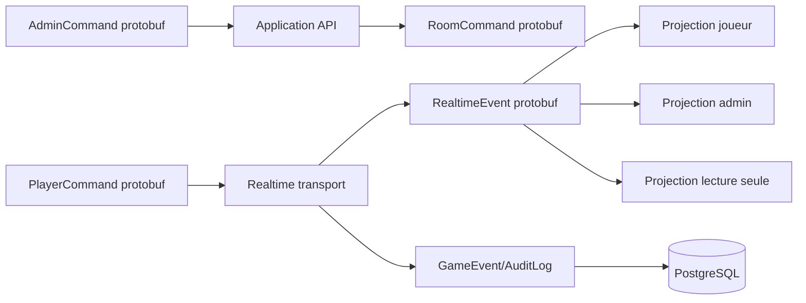

Contrats minimaux :

- Commands joueur.
- Commands admin.
- Events live.
- Snapshots lecture seule.
- Erreurs stables.
- Resultats provisoires et publies.

## 13. Matrice de permissions cible

Question : qui peut faire quoi ?

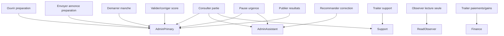

Decision ouverte : valider si les roles `AdminPrimary`, `AdminAssistant`, `Support`, `Finance` doivent
etre des roles produit distincts ou des permissions attribuables.

## 14. Deploiement logique

Question : comment deployer sans complexite inutile ?

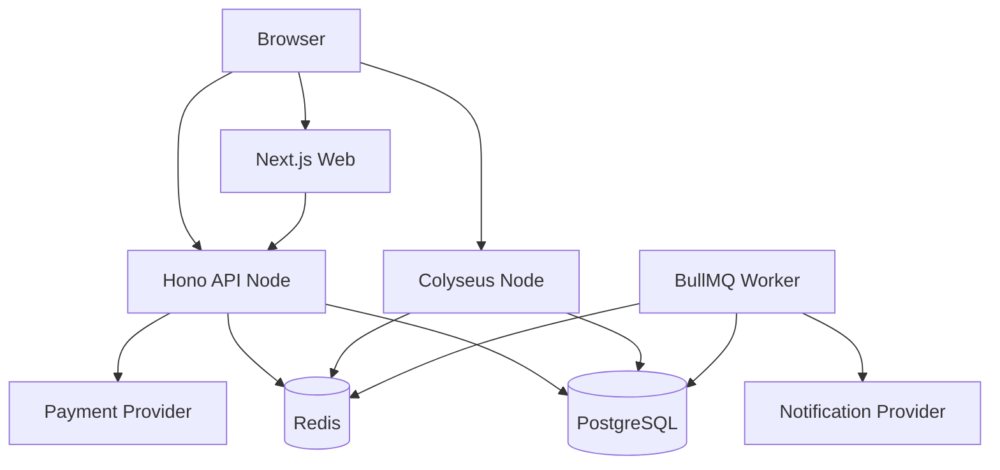

Decision : ce diagramme ne justifie pas microservices supplementaires. Il justifie seulement des
processus separes par runtime : web, API, game-server, worker.

## 15. Diagrammes a produire apres decisions

- ERD cible detaille apres validation du modele `GameParticipation`.
- Sequence exacte d'auth live apres decision cookie opaque vs token court.
- Diagramme par mini-jeu prioritaire apres choix du premier runtime a reconstruire.
- Diagramme de securite RBAC apres validation roles/permissions.
