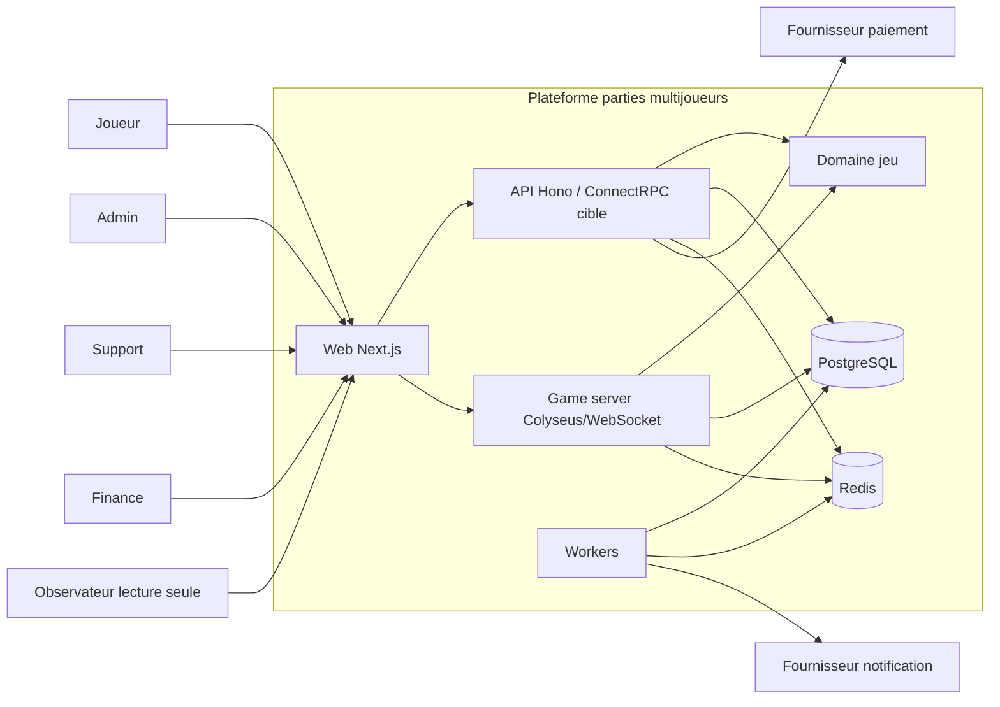
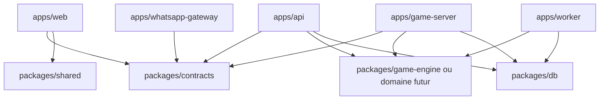

# UML - Contexte Systeme

Question: quels acteurs, runtimes et dependances entourent la plateforme ?

Interdictions:

- `apps/web` ne depend jamais de `packages/db`.
- Les contrats reseau ne sont pas des entites Prisma.
- Le game-server ne possede pas les workflows admin complets.
