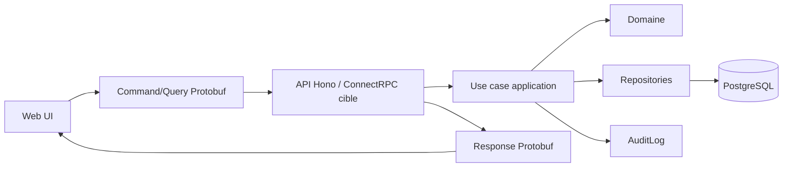
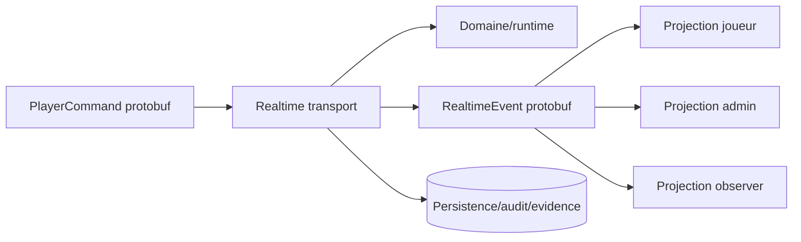

# UML - Data Flow

Question: comment les messages, projections et donnees durables circulent ?

Regles:

- Les schemas Prisma ne sortent pas comme contrats reseau.
- Une projection a toujours une audience.
- Les champs sensibles sont exclus par contrat, pas seulement caches par UI.
