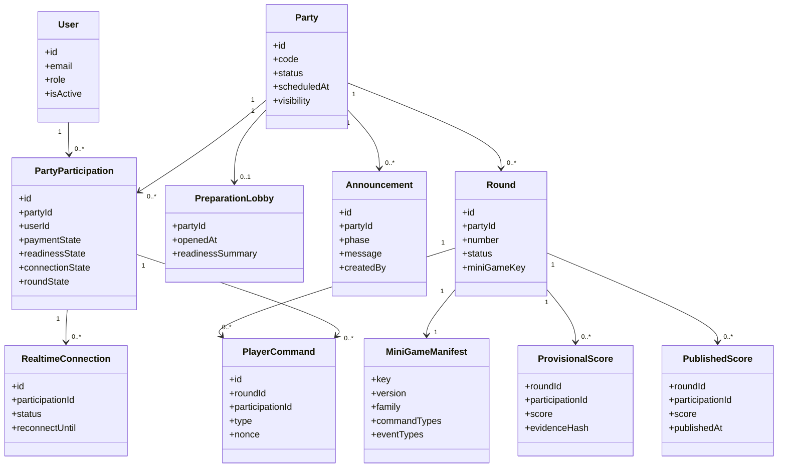

# UML - Domaines

Question: quels concepts produit doivent rester distincts ?

```mermaid
classDiagram
  class User {
    +id
    +email
    +role
    +isActive
  }
  class Party {
    +id
    +code
    +status
    +scheduledAt
    +visibility
  }
  class PartyParticipation {
    +id
    +partyId
    +userId
    +paymentState
    +readinessState
    +connectionState
    +roundState
  }
  class PreparationLobby {
    +partyId
    +openedAt
    +readinessSummary
  }
  class Announcement {
    +id
    +partyId
    +phase
    +message
    +createdBy
  }
  class Round {
    +id
    +partyId
    +number
    +status
    +miniGameKey
  }
  class MiniGameManifest {
    +key
    +version
    +family
    +commandTypes
    +eventTypes
  }
  class PlayerCommand {
    +id
    +roundId
    +participationId
    +type
    +nonce
  }
  class ProvisionalScore {
    +roundId
    +participationId
    +score
    +evidenceHash
  }
  class PublishedScore {
    +roundId
    +participationId
    +score
    +publishedAt
  }
  class RealtimeConnection {
    +id
    +participationId
    +status
    +reconnectUntil
  }

  User "1" --> "0..*" PartyParticipation
  Party "1" --> "0..*" PartyParticipation
  Party "1" --> "0..1" PreparationLobby
  Party "1" --> "0..*" Announcement
  Party "1" --> "0..*" Round
  Round "1" --> "1" MiniGameManifest
  Round "1" --> "0..*" PlayerCommand
  Round "1" --> "0..*" ProvisionalScore
  Round "1" --> "0..*" PublishedScore
  PartyParticipation "1" --> "0..*" RealtimeConnection
  PartyParticipation "1" --> "0..*" PlayerCommand
```

Decision: `PartyParticipation` est le pivot qui separe inscription, paiement, presence, connexion et etat
de round.
