# UML - Permissions

Question: qui peut faire quoi ?

```mermaid
flowchart TB
  ViewPublic[Consulter partie publique] --> Player[Joueur]
  Register[S'inscrire] --> Player
  MarkReady[Cliquer Je suis pret] --> Player
  Submit[Envoyer action mini-jeu] --> Player

  ViewAdmin[Consulter command center] --> Admin[Admin]
  OpenPrep[Ouvrir preparation] --> Admin
  StartRound[Demarrer manche] --> Admin
  Verify[Verifier/corriger score] --> Admin
  Publish[Publier resultats] --> Admin

  Observe[Observer lecture seule] --> Observer[Observateur]
  SupportRead[Voir dossier/support/audit] --> Support[Support]
  FinanceRead[Voir ledger/reconciliation] --> Finance[Finance]
```

Regles:

- Le joueur ne demarre pas, ne verifie pas et ne publie pas.
- Le support lit par defaut et ne publie pas sans permission explicite.
- La finance ne commande pas les rounds.
- L'observateur n'envoie aucun input.
- Le worker peut rappeler, expirer ou fermer techniquement, mais ne demarre pas une manche active et ne publie pas un score.
