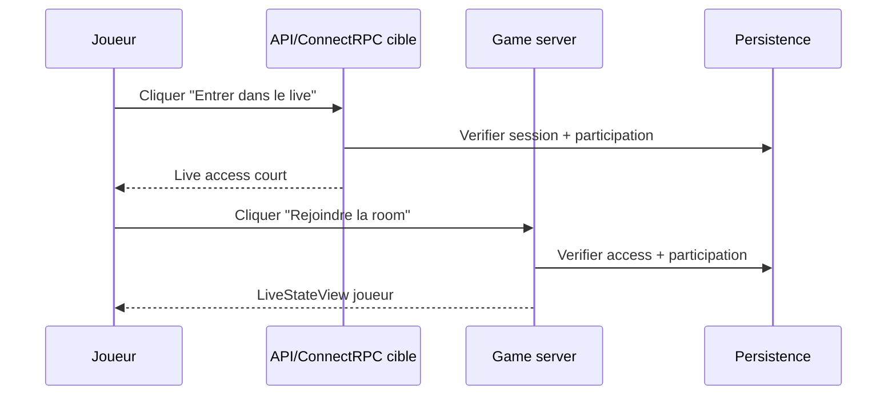
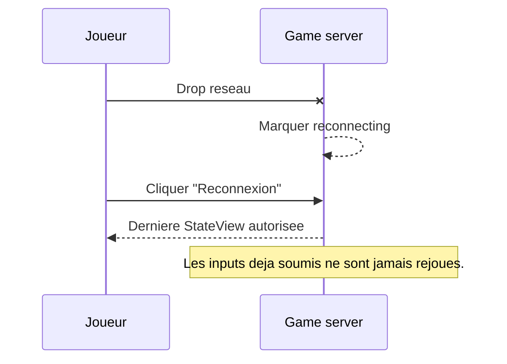
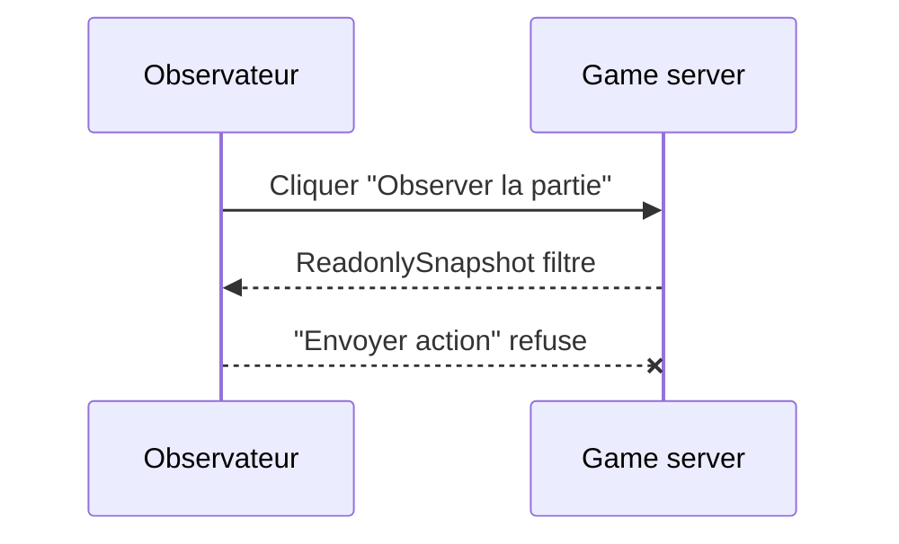

# UML - Realtime Flow

Question: comment rejoindre, jouer, reconnecter et observer sans fuite ?

```mermaid
sequenceDiagram
  participant P as Joueur
  participant API as API/ConnectRPC cible
  participant Room as Game server
  participant DB as Persistence

  P->>API: Cliquer "Entrer dans le live"
  API->>DB: Verifier session + participation
  API-->>P: Live access court
  P->>Room: Cliquer "Rejoindre la room"
  Room->>DB: Verifier access + participation
  Room-->>P: LiveStateView joueur
```

```mermaid
sequenceDiagram
  participant P as Joueur
  participant Room as Game server

  P-xRoom: Drop reseau
  Room-->>Room: Marquer reconnecting
  P->>Room: Cliquer "Reconnexion"
  Room-->>P: Derniere StateView autorisee
  Note over Room: Les inputs deja soumis ne sont jamais rejoues.
```

```mermaid
sequenceDiagram
  participant O as Observateur
  participant Room as Game server

  O->>Room: Cliquer "Observer la partie"
  Room-->>O: ReadonlySnapshot filtre
  O--xRoom: "Envoyer action" refuse
```
