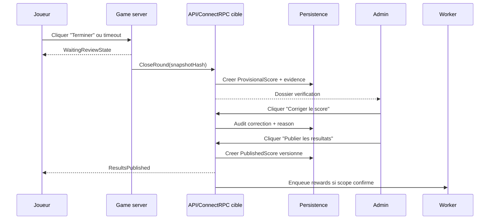

# UML - Scoring Et Publication

Question: comment separer score provisoire, verification et publication ?

Regles:

- Le joueur ne voit pas les scores provisoires.
- Une correction admin exige une raison.
- Les gains ne partent pas avant publication validee.
