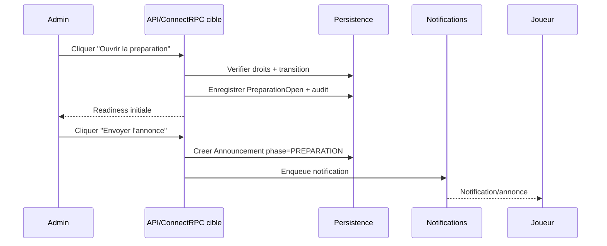
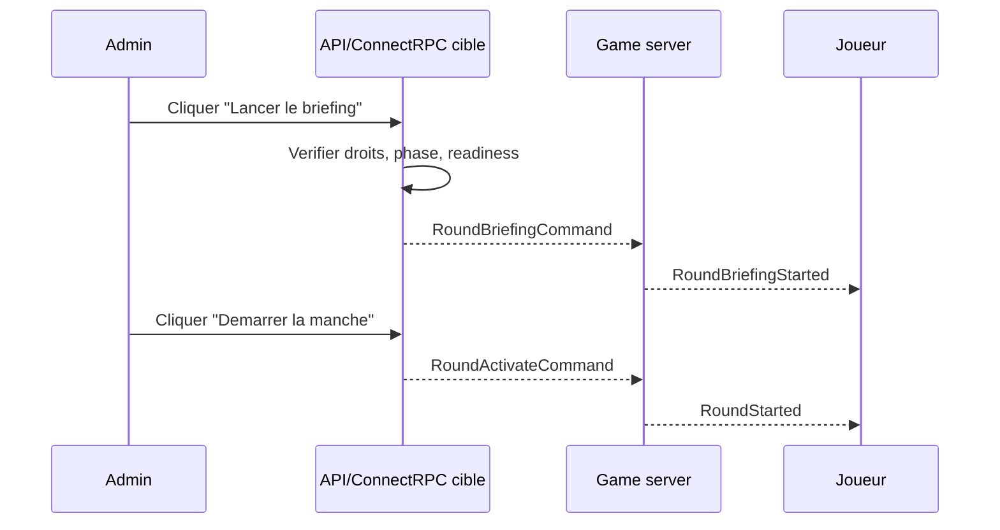
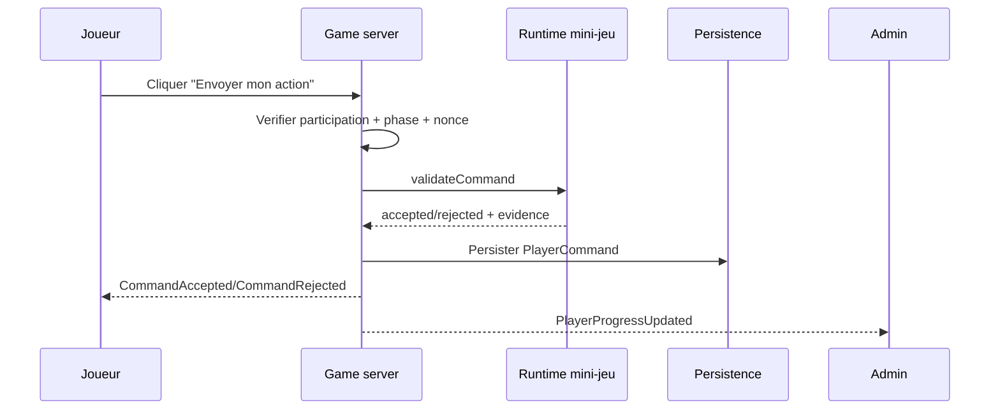
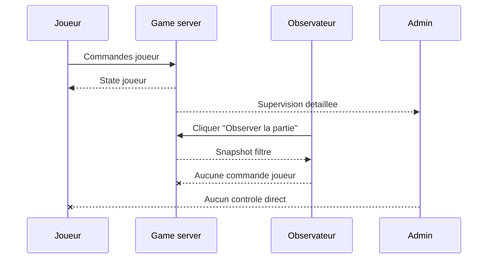

# UML - Sequences Produit

## Preparation Et Annonce

```mermaid
sequenceDiagram
  participant A as Admin
  participant API as API/ConnectRPC cible
  participant DB as Persistence
  participant N as Notifications
  participant P as Joueur

  A->>API: Cliquer "Ouvrir la preparation"
  API->>DB: Verifier droits + transition
  API->>DB: Enregistrer PreparationOpen + audit
  API-->>A: Readiness initiale
  A->>API: Cliquer "Envoyer l'annonce"
  API->>DB: Creer Announcement phase=PREPARATION
  API->>N: Enqueue notification
  N-->>P: Notification/annonce
```

## Lancement Manuel De Manche

```mermaid
sequenceDiagram
  participant A as Admin
  participant API as API/ConnectRPC cible
  participant Room as Game server
  participant P as Joueur

  A->>API: Cliquer "Lancer le briefing"
  API->>API: Verifier droits, phase, readiness
  API-->>Room: RoundBriefingCommand
  Room-->>P: RoundBriefingStarted
  A->>API: Cliquer "Demarrer la manche"
  API-->>Room: RoundActivateCommand
  Room-->>P: RoundStarted
```

## Commande Joueur

```mermaid
sequenceDiagram
  participant P as Joueur
  participant Room as Game server
  participant Engine as Runtime mini-jeu
  participant DB as Persistence
  participant A as Admin

  P->>Room: Cliquer "Envoyer mon action"
  Room->>Room: Verifier participation + phase + nonce
  Room->>Engine: validateCommand
  Engine-->>Room: accepted/rejected + evidence
  Room->>DB: Persister PlayerCommand
  Room-->>P: CommandAccepted/CommandRejected
  Room-->>A: PlayerProgressUpdated
```

## Observation Lecture Seule

```mermaid
sequenceDiagram
  participant P as Joueur
  participant Room as Game server
  participant O as Observateur
  participant A as Admin

  P->>Room: Commandes joueur
  Room-->>P: State joueur
  Room-->>A: Supervision detaillee
  O->>Room: Cliquer "Observer la partie"
  Room-->>O: Snapshot filtre
  O--xRoom: Aucune commande joueur
  A--xP: Aucun controle direct
```
