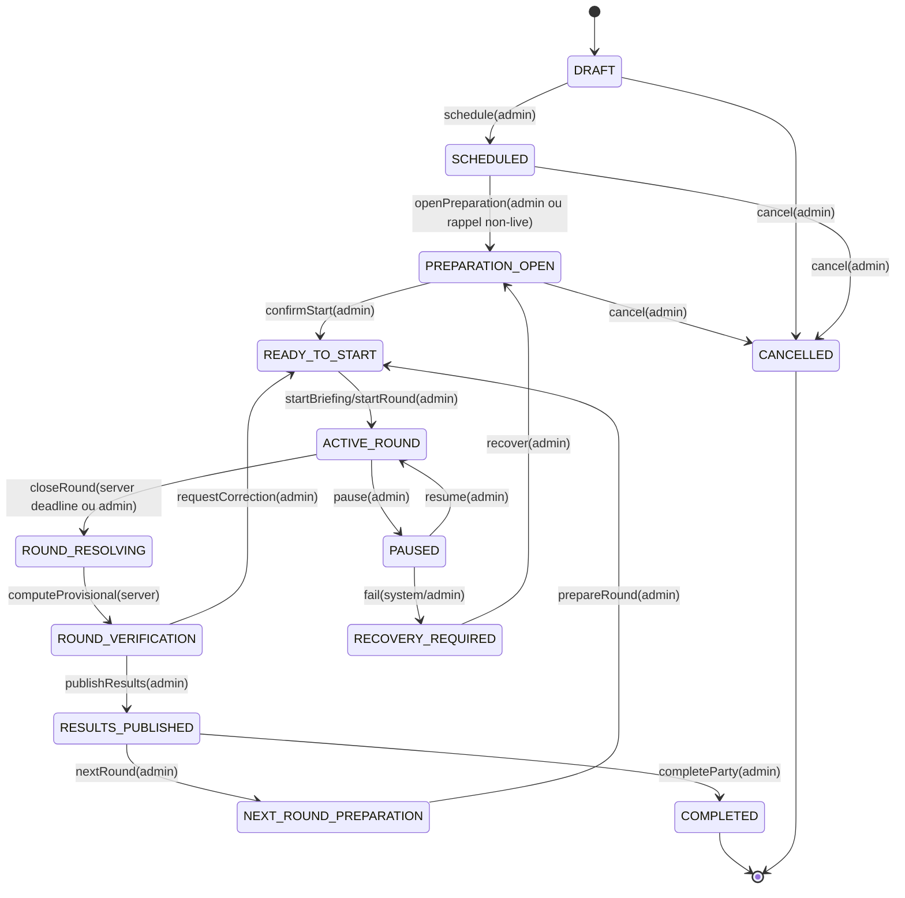
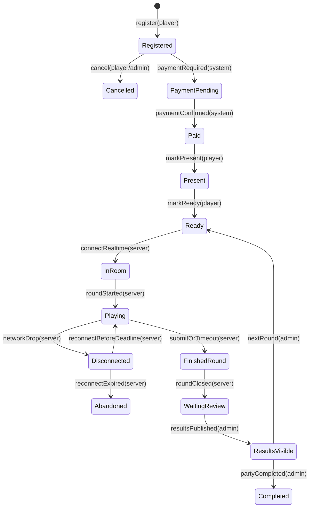

# UML - Machines D'Etat

## Partie

Les noms d'etat produit canoniques sont ceux de `docs/01-product/session-lifecycle.md`. Les libelles
CamelCase ci-dessous sont des alias visuels; tout contrat ou test doit utiliser les valeurs canoniques.

Transitions interdites:

- `SCHEDULED -> ACTIVE_ROUND` par timer.
- `PREPARATION_OPEN -> ACTIVE_ROUND` sans action admin.
- `ROUND_RESOLVING -> RESULTS_PUBLISHED` sans verification explicite.

## Participation

Les etats paiement, preparation, connexion et round ne doivent pas etre ecrases dans un seul enum.
