# Diagrammes de conception

Ces diagrammes cadrent l'implementation. Ils doivent etre mis a jour si le modele metier change.

## 1. Diagramme de contexte general

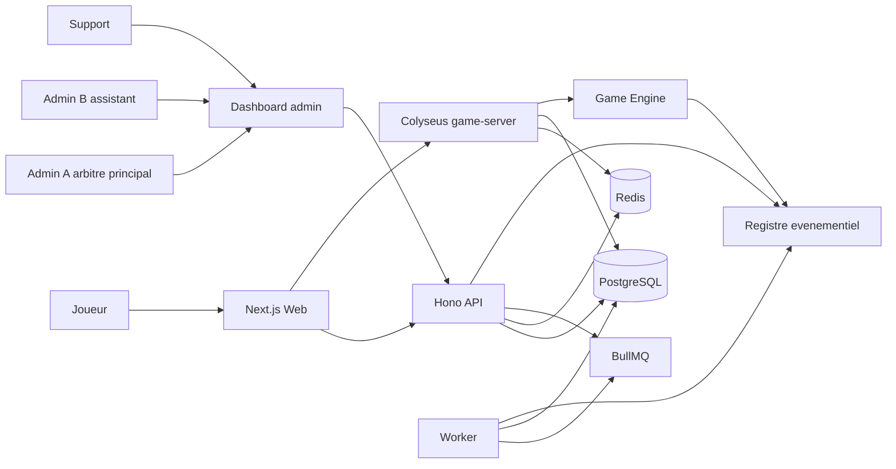

## 2. Architecture Session Orchestrator / Rooms / Event Store

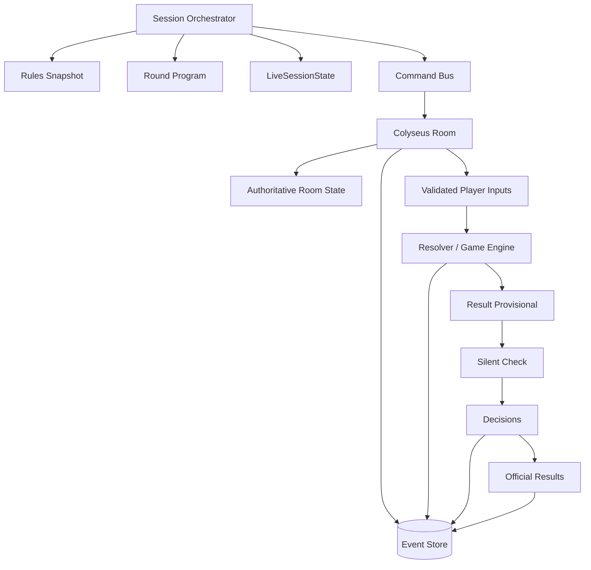

## 3. Machine d'etat d'une session

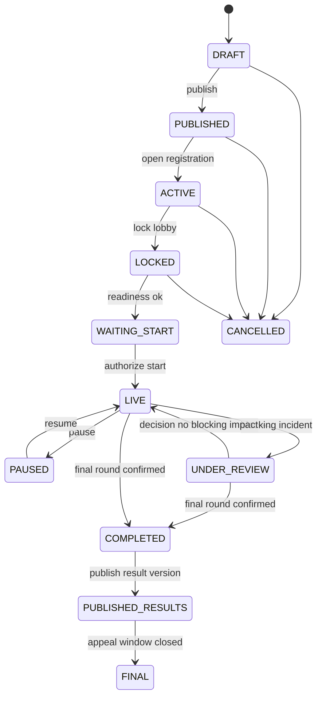

## 4. Machine d'etat d'un round

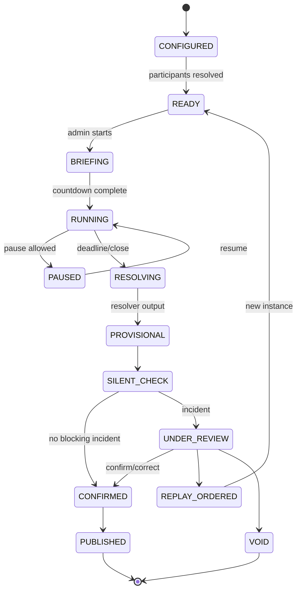

## 5. Sequence de creation de session

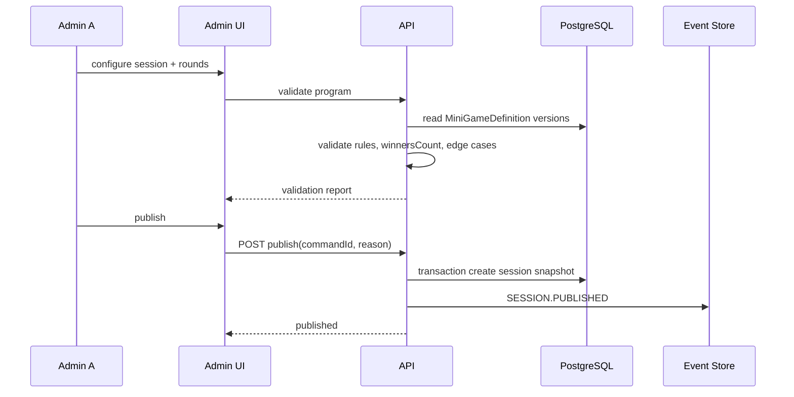

## 6. Sequence de lancement d'un round

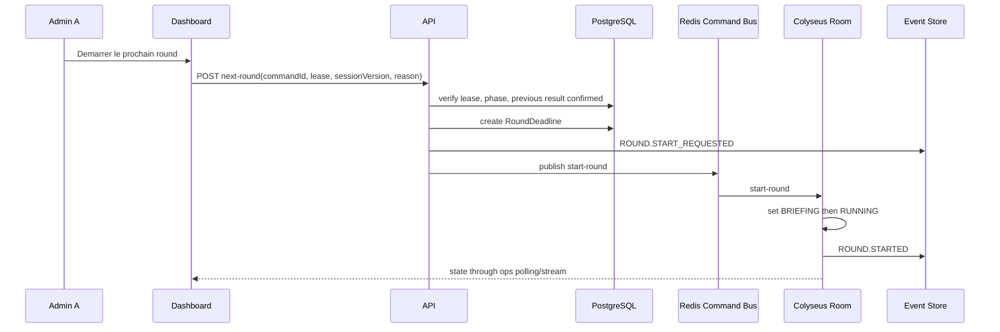

## 7. Sequence de reconnexion

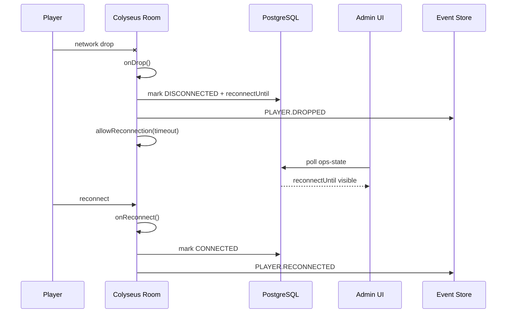

## 8. Sequence multi-admin

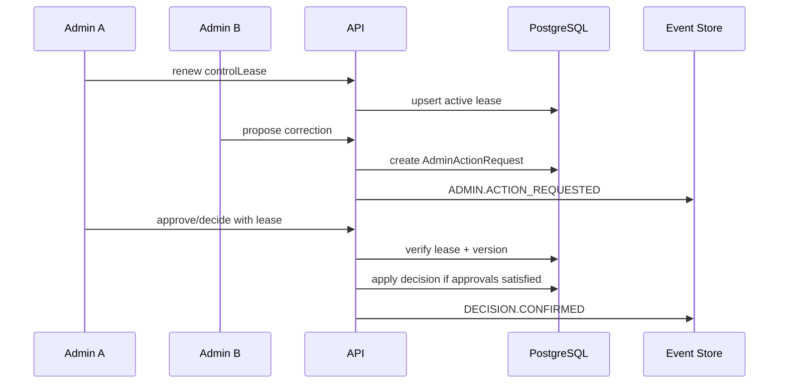

## 9. Sequence incident et revision

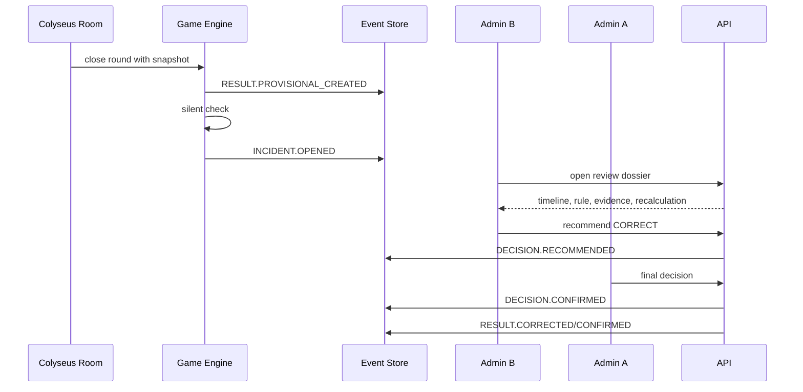

## 10. Sequence de vote secret

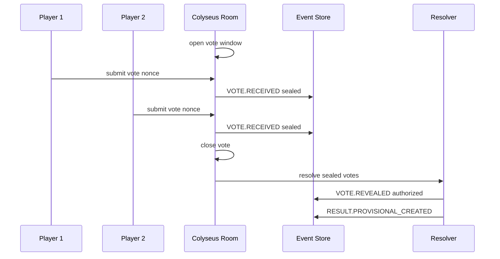

## 11. Sequence de publication des resultats

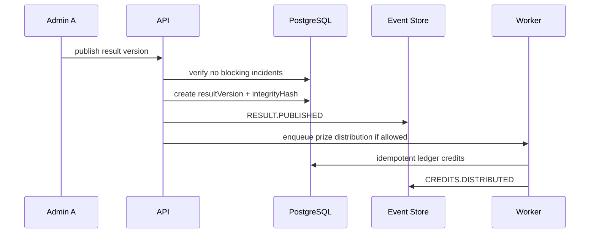

## 12. Modele de donnees cible

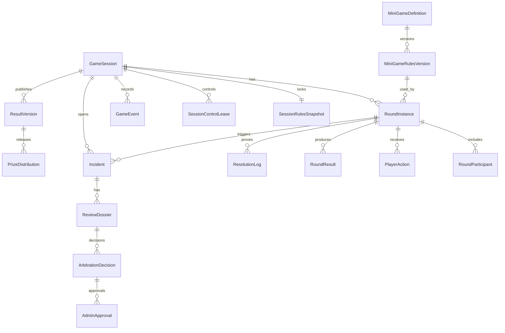

## 13. Matrice des permissions

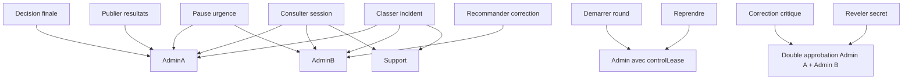

## 14. Schema du registre d'evenements

```mermaid
flowchart LR
  E1[previousEventHash] --> E2[eventId + sequenceNumber]
  E2 --> E3[serverTimestamp]
  E3 --> E4[eventType]
  E4 --> E5[payload]
  E5 --> E6[ruleReference]
  E6 --> E7[previousStateHash]
  E7 --> E8[newStateHash]
  E8 --> E9[traceId + sourceService]
  E9 --> E10[next previousEventHash]
```

## 15. Wireframes Admin A et Admin B

### Admin A

```text
+--------------------------------------------------------------------+
| SESSION | ROUND | PHASE | RESULT STATUS | LEASE | SERVER HEALTH    |
+--------------------------------------------------------------------+
| Action principale | Blocages | Pause | Transferer | Publier        |
+-------------------+--------------------------------+---------------+
| Match en direct                                    | Decisions     |
| - round actuel                                     | - a trancher  |
| - timer                                            | - approvals   |
| - participants                                     | - publication |
+----------------------------------------------------+---------------+
| Timeline rounds | Resultats provisoires | Feuille de match       |
+--------------------------------------------------------------------+
```

### Admin B

```text
+--------------------------------------------------------------------+
| SESSION | ROUND | INCIDENTS | REVISION QUEUE | SERVER HEALTH       |
+--------------------------------------------------------------------+
| Players monitor         | Centre d'arbitrage                      |
| - connexions            | - incidents ouverts                     |
| - submissions           | - preuves                               |
| - latence               | - recommandations                       |
| - tickets               | - approvals critiques                   |
+--------------------------------------------------------------------+
| Event replay | Chat/support | Anti-cheat | Reglement applicable    |
+--------------------------------------------------------------------+
```
