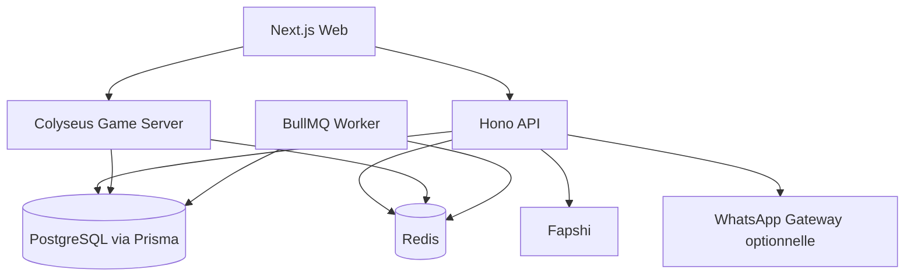
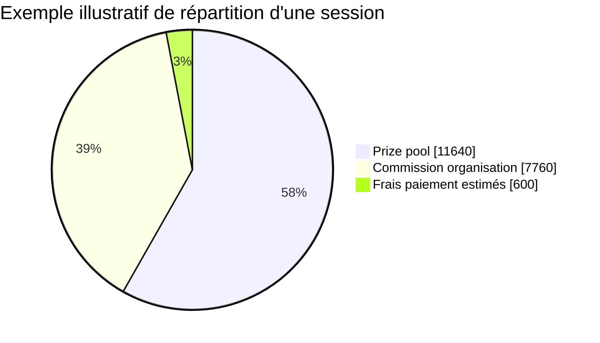
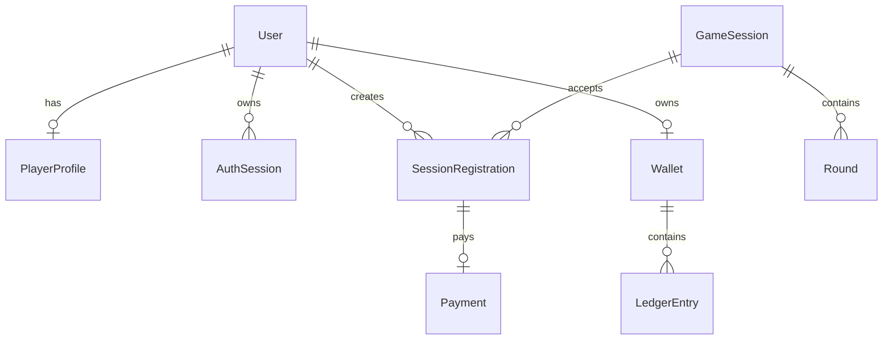
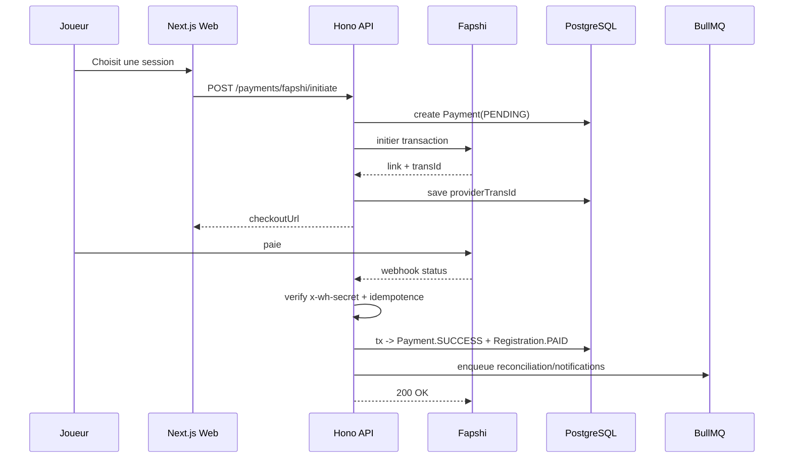
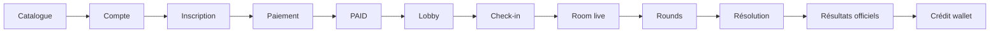

# Cahier des charges technique V1 pour une plateforme web de sessions de jeu multijoueur

## Résumé exécutif

La V1 doit être conçue comme une **plateforme web de sessions payantes autonomes**, et non comme un jeu d’argent, un pari, ni un “grand tournoi global” avec redistribution finale unique. Le socle métier déjà stabilisé dans vos documents internes est cohérent avec cette orientation : `GameSession` comme unité économique indépendante, paiement par session, wallet interne non retirable en V1, ledger obligatoire, moteur de jeu séparé du temps réel, WhatsApp non critique, et vérité durable portée par PostgreSQL/Prisma plutôt que par le client ou Colyseus. fileciteturn0file0 fileciteturn0file2 fileciteturn0file3

La recommandation d’architecture la plus robuste pour cette V1 est la suivante : **Next.js** pour les surfaces web publiques, joueur et admin ; **Hono** pour l’API HTTP, les middlewares de sécurité, la validation et les webhooks ; **Colyseus** pour les rooms, le state sync, les timers live perçus et la reconnexion ; **Prisma/PostgreSQL** pour les transactions critiques et la persistance réglementaire/audit ; **Redis/BullMQ** pour la présence inter-processus, les deadlines, la récupération sur incident et les workers différés. Cette séparation correspond à la fois aux contraintes de vos documents internes et aux capacités recommandées par les documentations officielles de Next.js, Colyseus, Prisma, Redis et BullMQ. citeturn22view0turn22view1turn21view0turn13view0turn14view1turn15view1turn15view3turn3view7 fileciteturn0file0

Les trois décisions les plus importantes pour la production sont les suivantes. D’abord, **toute valeur critique doit être recalculée côté serveur** : prix, totaux, capacité restante, statuts, scores, éliminations, gains, soldes et transitions d’état. Ensuite, **toute mutation sensible doit être transactionnelle, idempotente et auditée** : confirmation de paiement, débit wallet, check-in, clôture de round, distribution de gains, ajustement admin. Enfin, **les workflows doivent être modélisés comme des machines d’état explicites**, car OWASP recommande d’imposer les workflows côté serveur, de retraiter les valeurs de sécurité côté serveur, de prévenir les race conditions et de tester explicitement les abus métier. citeturn12view2turn21view3turn21view0turn3view7turn19view0

Le cadrage conformité doit rester prudent. Vos documents internes identifient déjà le risque principal : une compétition payante avec gains peut changer de qualification juridique selon le pays, l’importance du hasard, le mécanisme de redistribution et la possibilité ou non de retrait en argent réel. Pour cette raison, la V1 doit **bloquer tout retrait monétaire**, traiter le wallet comme **crédit interne non retirable**, limiter ou exclure les mécaniques où le hasard domine, rendre les calculs et les journaux de résolution contestables/auditables, et exposer des CGU/règles/règles de remboursement avant mise en production publique. fileciteturn0file2 fileciteturn0file16

## Cadre de conception et architecture cible

Le périmètre fonctionnel V1 est bien posé par vos 15 branches : acquisition, auth, profil, admin config, inscription, paiement Fapshi, wallet/ledger, lobby, live temps réel, game engine, catalogue de mini-jeux, résultats/crédits, dashboard admin, WhatsApp, sécurité/conformité. La lecture la plus saine de ce périmètre consiste à considérer que certaines valeurs sont **paramétrables et encore ouvertes** : frais provider réels, délais de check-in, fenêtre de reconnexion, politique de no-show, période de contestation, nombre de gagnants par défaut, règles exactes de remboursement. Le cahier des charges doit donc distinguer clairement ce qui est **verrouillé**, ce qui est **recommandé**, et ce qui est **à confirmer produit/légalement**. fileciteturn0file3

Le schéma applicatif recommandé pour V1 est le suivant.



Cette séparation respecte les recommandations documentées. Next.js recommande de garder l’authentification, l’autorisation et la logique Data Access Layer dans des modules `server-only`, et de ne renvoyer au client que les données nécessaires à l’UI. Colyseus documente un modèle de room authoritative, un mécanisme de `Presence` local ou Redis selon l’échelle, un `clock` pour les timers live, et une reconnexion explicite via `allowReconnection()`. Prisma documente plusieurs styles transactionnels — nested writes, `$transaction([])`, interactive transactions et OCC — qui se prêtent bien à la séparation mutation HTTP / orchestration temps réel / workers. citeturn22view0turn11view3turn13view0turn14view1turn2view2turn21view1turn21view2turn11view5

Le choix de **sessions serveur** est le meilleur arbitrage V1 pour l’auth web, plutôt qu’un modèle “full JWT bearer partout”. Next.js distingue sessions stateless et database sessions, en notant que la session en base est plus sûre mais plus coûteuse, et recommande l’usage de cookies gérés côté serveur. OWASP recommande des cookies `HttpOnly`, `Secure` et `SameSite`, avec stratégie explicite plutôt que confiance dans les valeurs par défaut du navigateur. Pour un produit avec wallet, back-office, audit et rôles sensibles, le compromis recommandé est : **session ID chiffré en cookie + session en base + rotation au login/changement de privilège**. citeturn22view1turn22view2turn11view8turn11view7turn17view1

Le choix de **Redis Presence + PostgreSQL deadline + BullMQ delayed jobs** est, lui aussi, supérieur à une stratégie “tout en room memory” ou “tout en base”. Colyseus documente que `LocalPresence` suffit en mono-processus, mais que `RedisPresence` est requis en multi-processus/distribué. BullMQ documente les jobs différés et les `jobId` uniques comme mécanisme de non-duplication. PostgreSQL et Prisma documentent que les transactions critiques doivent être soit exécutées en isolation plus forte, soit rejouées avec retry contrôlé en cas de conflit. En pratique, cela permet d’avoir : **timer ressenti en live dans Colyseus**, **deadline officielle persistée en DB**, **filet de sécurité worker** si un process live tombe. citeturn13view0turn15view1turn15view3turn21view0turn11view6

Le tableau suivant synthétise les alternatives utiles pour l’auth web et la présence. Il s’agit d’une synthèse d’architecture fondée sur les docs officielles citées, et non d’une obligation normative de ces outils. citeturn22view1turn11view8turn13view0turn15view3turn21view0

| Sujet | Option | Avantages | Limites | Recommandation V1 |
|---|---|---|---|---|
| Gestion de session | Cookie signé/stateless | Simple, peu de lectures DB | Révocation plus complexe, contrôle multi-device plus limité | Non prioritaire |
| Gestion de session | Session DB + cookie ID chiffré | Révocation, traçabilité, contrôle admin et appareils | Plus de lectures/écritures | **Oui** |
| Gestion de session | JWT bearer pur | Pratique pour API tierces | Plus risqué côté navigateur, révocation délicate | Non recommandé en principal |
| Présence live | LocalPresence Colyseus | Très simple | Mono-processus | Dev seulement |
| Présence live | RedisPresence Colyseus | Multi-processus, pub/sub, K/V partagé | Redis obligatoire | **Oui** |
| Deadlines | Colyseus uniquement | Faible latence | Pas assez robuste au crash | Non |
| Deadlines | PostgreSQL + BullMQ | Durable, reprenable après incident | Plus de complexité | **Oui** |

## Principes transverses de modélisation et contrats techniques

Le **premier invariant** du système doit être monétaire : tous les montants sont stockés en **entiers XAF**, jamais en flottants. Toutes les proportions sont stockées en **basis points** (`bps`, 1/100 de pourcent), ce qui évite les erreurs binaires et simplifie l’audit. Sur cette base, les formules recommandées sont :

- `grossCollectionXaf = paidRegistrationsCount * entryFeeXaf`
- `estimatedFeesXaf = ceil(grossCollectionXaf * providerFeeBps / 10000)` pour l’estimation prudente avant settlement
- `netCollectionXaf = grossCollectionXaf - settledFeesXaf`
- `prizePoolXaf = floor(netCollectionXaf * prizePoolBps / 10000)`
- `organizationCommissionXaf = netCollectionXaf - prizePoolXaf`
- `winnerShareXaf[i] = floor(prizePoolXaf * winnerSplitBps[i] / 10000)`
- `roundingRemainderXaf = prizePoolXaf - sum(winnerShareXaf[])`

Le reliquat de division entière doit être affecté par une politique explicite et auditée : `FIRST_WINNER`, `LAST_WINNER`, `RESERVE_WALLET`, ou `ROLL_FORWARD_TO_PLATFORM_COMMISSION`. Cette règle est métier, pas purement technique, donc elle doit être configurable ou au minimum documentée publiquement. Les formules de collecte, net, prize pool et commission sont déjà cohérentes avec vos documents internes. fileciteturn0file0 fileciteturn0file13

L’exemple économique interne déjà validé reste une bonne **illustration** pour l’interface admin, sans devenir une hypothèse produit figée. Pour 20 joueurs à 1 000 XAF, avec 3 % de frais estimés et un split net 60/40, la collecte brute est de 20 000 XAF, les frais de 600 XAF, la collecte nette de 19 400 XAF, le prize pool de 11 640 XAF et la commission organisation de 7 760 XAF. Cet exemple doit apparaître dans l’admin comme **simulation**, jamais comme promesse externe si le barème réel de frais n’est pas encore contractuellement verrouillé. fileciteturn0file0



Le **deuxième invariant** doit être workflow : toute feature sensible doit être une machine d’état serveur. OWASP recommande explicitement de réimposer côté serveur les valeurs de sécurité, de modéliser les workflows comme des state machines explicites, de rejeter les replays d’étapes terminées et de prévenir les races sur les opérations sensibles. Cela s’applique directement à `SessionRegistrationStatus`, `PaymentStatus`, `GameSessionStatus` et `RoundStatus`. citeturn12view2 fileciteturn0file0

Le **troisième invariant** doit être transactionnel. Prisma documente trois familles réellement utiles ici. Les **nested writes** pour des créations dépendantes atomiques. Le **`$transaction([])`** pour des écritures indépendantes à committer ensemble. Les **interactive transactions** pour les cas `read → validate → write` comme un débit wallet, un check de capacité ou une clôture de round. Prisma permet aussi de monter le niveau d’isolation à `Serializable`; PostgreSQL documente alors que l’application doit être prête à rejouer certaines transactions en cas de `serialization failure`. C’est exactement ce qu’il faut pour les sections les plus sensibles : réservation de place, paiement/wallet, distribution de gains, ajustements admin. citeturn21view1turn21view2turn21view0turn11view6

Un schéma de données minimal mais production-ready pour V1 peut être structuré ainsi.

```prisma
enum UserRole {
  PLAYER
  SUPPORT
  FINANCE
  ADMIN
  SUPER_ADMIN
}

enum GameSessionStatus {
  DRAFT
  PUBLISHED
  REGISTRATION_OPEN
  REGISTRATION_CLOSED
  WAITING_START
  LIVE
  PAUSED
  FINISHED
  CANCELLED
}

enum SessionRegistrationStatus {
  CREATED
  PAYMENT_PENDING
  PAID
  CHECKED_IN
  IN_ROOM
  ACTIVE
  ELIMINATED
  WINNER
  DISQUALIFIED
  REFUNDED
  CANCELLED
}

enum PaymentStatus {
  CREATED
  PENDING
  SUCCESS
  FAILED
  EXPIRED
  CANCELLED
  REFUNDED
}

enum LedgerDirection {
  DEBIT
  CREDIT
}

enum LedgerType {
  ENTRY_FEE
  PRIZE
  REFUND
  ADMIN_ADJUSTMENT
  PLATFORM_COMMISSION
}

model User {
  id              String   @id @default(cuid())
  email           String?  @unique
  phone           String?  @unique
  passwordHash    String
  role            UserRole @default(PLAYER)
  isActive        Boolean  @default(true)
  createdAt       DateTime @default(now())
  updatedAt       DateTime @updatedAt
  profile         PlayerProfile?
  authSessions    AuthSession[]
  auditLogs       AuditLog[] @relation("AuditActor")
}

model PlayerProfile {
  id                String   @id @default(cuid())
  userId            String   @unique
  nickname          String   @unique
  avatarUrl         String?
  sessionsPlayed    Int      @default(0)
  sessionsWon       Int      @default(0)
  user              User     @relation(fields: [userId], references: [id])
  wallet            Wallet?
}

model AuthSession {
  id              String   @id @default(cuid())
  userId          String
  expiresAt       DateTime
  revokedAt       DateTime?
  lastSeenAt      DateTime?
  ipHash          String?
  userAgentHash   String?
  user            User     @relation(fields: [userId], references: [id])
  @@index([userId, expiresAt])
}

model GameSession {
  id                   String             @id @default(cuid())
  slug                 String             @unique
  title                String
  visibility           String
  status               GameSessionStatus
  startsAt             DateTime
  registrationClosesAt DateTime?
  entryFeeXaf          Int
  minPlayers           Int
  maxPlayers           Int
  prizePoolBps         Int
  providerFeeBps       Int?
  configVersion        Int                @default(1)
  createdAt            DateTime           @default(now())
  updatedAt            DateTime           @updatedAt
  rounds               Round[]
  registrations        SessionRegistration[]
}

model SessionRegistration {
  id                 String                    @id @default(cuid())
  sessionId          String
  userId             String
  status             SessionRegistrationStatus
  seatVersion        Int                       @default(0)
  checkInAt          DateTime?
  paymentDeadlineAt  DateTime?
  createdAt          DateTime                  @default(now())
  updatedAt          DateTime                  @updatedAt
  session            GameSession               @relation(fields: [sessionId], references: [id])
  user               User                      @relation(fields: [userId], references: [id])
  payment            Payment?
  @@unique([sessionId, userId])
  @@index([sessionId, status])
}

model Payment {
  id                 String        @id @default(cuid())
  registrationId     String        @unique
  provider           String
  providerTransId    String?       @unique
  providerExternalId String?       @unique
  amountXaf          Int
  status             PaymentStatus
  providerPayload    Json?
  webhookReceivedAt  DateTime?
  settledAt          DateTime?
  createdAt          DateTime      @default(now())
  updatedAt          DateTime      @updatedAt
  registration       SessionRegistration @relation(fields: [registrationId], references: [id])
}

model Wallet {
  id              String   @id @default(cuid())
  userId          String   @unique
  balanceXaf      Int      @default(0)
  version         Int      @default(0)
  user            User     @relation(fields: [userId], references: [id])
  entries         LedgerEntry[]
}

model LedgerEntry {
  id              String          @id @default(cuid())
  walletId        String
  type            LedgerType
  direction       LedgerDirection
  amountXaf       Int
  balanceAfterXaf Int
  referenceType   String
  referenceId     String
  idempotencyKey  String          @unique
  createdAt       DateTime        @default(now())
  wallet          Wallet          @relation(fields: [walletId], references: [id])
  @@index([walletId, createdAt])
}

model Round {
  id              String   @id @default(cuid())
  sessionId       String
  ordinal         Int
  miniGameKey     String
  configJson      Json
  deadlineAt      DateTime?
  createdAt       DateTime @default(now())
  session         GameSession @relation(fields: [sessionId], references: [id])
  @@unique([sessionId, ordinal])
}

model AuditLog {
  id              String   @id @default(cuid())
  actorId         String?
  action          String
  targetType      String
  targetId        String
  beforeJson      Json?
  afterJson       Json?
  reason          String?
  ipHash          String?
  userAgentHash   String?
  requestId       String?
  createdAt       DateTime @default(now())
  actor           User?    @relation("AuditActor", fields: [actorId], references: [id])
}
```

Ce noyau correspond à vos objets métier centraux, avec deux ajouts fortement recommandés pour la prod : `configVersion` pour l’OCC sur les modifications de session et `idempotencyKey` pour le ledger. Vos documents internes convergent déjà vers ce noyau (`User`, `PlayerProfile`, `GameSession`, `SessionRegistration`, `Payment`, `Wallet`, `LedgerEntry`, `Round`, `AuditLog`, etc.). Prisma documente l’usage d’un champ de version ou d’un timestamp comme jeton OCC, et l’usage de transactions interactives ou séquentielles selon le cas. fileciteturn0file0 fileciteturn0file2 citeturn11view5turn21view1



Les conventions API doivent être homogènes sur tout le système. Recommandation : `application/json`, `X-Request-Id`, `Idempotency-Key` sur toutes les mutations à effet financier, réponses d’erreur structurées `{ code, message, details, retryable }`, et stock de validation côté Hono avec `validator()` ou `zValidator()`. Hono documente la validation ciblée par zone (`param`, `query`, `json`, `form`) et le middleware `requestId`; ses helpers cookie et `secureHeaders()` couvrent les besoins de base HTTP. citeturn17view2turn17view3turn23view1turn3view0turn17view1

L’exemple suivant est une base saine pour l’API Hono.

```ts
import { Hono } from 'hono'
import { z } from 'zod'
import { zValidator } from '@hono/zod-validator'
import { secureHeaders } from 'hono/secure-headers'
import { requestId } from 'hono/request-id'
import { setSignedCookie } from 'hono/cookie'

const app = new Hono()

app.use('*', requestId())
app.use('*', secureHeaders())

const loginSchema = z.object({
  email: z.string().email(),
  password: z.string().min(8),
})

app.post(
  '/v1/auth/login',
  zValidator('json', loginSchema),
  async (c) => {
    const body = c.req.valid('json')
    // vérifier credentials en DAL/server-only
    const sessionId = 'sess_123'
    await setSignedCookie(c, '__Host-session', sessionId, process.env.SESSION_SECRET!, {
      path: '/',
      httpOnly: true,
      secure: true,
      sameSite: 'Strict',
      prefix: 'host',
    })
    return c.json({ ok: true, requestId: c.get('requestId') }, 200)
  }
)
```

Cet exemple est directement aligné avec les docs Hono pour `secureHeaders`, `requestId`, `cookie helper` et `zValidator`. citeturn3view0turn23view1turn17view1turn17view3

Côté Next.js, la doc officielle recommande aussi de garder la logique HTTP et d’accès aux données dans des modules serveur dédiés, typiquement `server-only`, avec des Server Actions fines qui délèguent au Data Access Layer. Cela correspond parfaitement à votre besoin de séparer **pages/UI**, **API Hono**, et **transactions Prisma**. citeturn22view0turn11view3

```ts
// app/lib/session.ts
import 'server-only'
import { cookies } from 'next/headers'

export async function writeSessionCookie(session: string, expiresAt: Date) {
  const cookieStore = await cookies()
  cookieStore.set('session', session, {
    httpOnly: true,
    secure: true,
    expires: expiresAt,
    sameSite: 'lax',
    path: '/',
  })
}
```

Cet usage est conforme au guide officiel Next.js sur l’authentification et aux recommandations OWASP sur les attributs des cookies de session. citeturn22view2turn11view8

## Spécification détaillée par feature

**Acquisition, landing et catalogue public**

_Règles métier et calculs._ Le catalogue public ne doit exposer que les sessions `PUBLIC`; les sessions `UNLISTED` doivent être consultables par URL directe mais absentes des listings; les sessions `PRIVATE` doivent exiger une invitation, une allowlist ou un code d’accès. Les indicateurs affichés côté catalogue doivent être dérivés côté serveur : `placesRemaining = max(0, maxPlayers - activeRegistrationsCount)`, où `activeRegistrationsCount` doit exclure les `CANCELLED` et `REFUNDED`, et inclure au minimum `PAYMENT_PENDING` encore valides et `PAID` selon la politique de réservation choisie. Le wording public doit rester celui d’une compétition structurée et non d’un pari. fileciteturn0file4 fileciteturn0file0

_Modèles, API et flux._ Les modèles concernés sont `GameSession` et un éventuel `SessionInvite`. Contrats proposés : `GET /v1/public/sessions`, `GET /v1/public/sessions/:slug`, `POST /v1/public/sessions/:slug/access-code`. Réponse exemple : `{ "slug":"night-drop-2026-07-22", "status":"REGISTRATION_OPEN", "entryFeeXaf":1000, "placesRemaining":7, "startsAt":"2026-07-22T20:00:00+01:00" }`. Les erreurs typiques sont `404_SESSION_NOT_VISIBLE`, `410_SESSION_CLOSED`, `423_ACCESS_CODE_REQUIRED`. Les tests doivent couvrir SEO/metadata, filtrage de visibilité, calcul de `placesRemaining`, et absence de fuite d’informations pour `PRIVATE`. Côté monitoring : `catalogue_page_view`, `session_detail_view`, `cta_register_click`, `share_link_open_rate`, alerte si `GET /public/sessions` > 1 % d’erreurs sur 5 minutes. Next.js convient bien à ces pages publiques, au rendu metadata et aux redirections conditionnelles. citeturn22view1turn11view3 fileciteturn0file4

**Authentification et gestion de compte**

_Règles métier et calculs._ Le joueur choisit son mot de passe; les admins utilisent email + mot de passe dès V1; la 2FA admin reste ouverte mais recommandée post-MVP si la pression d’exploitation augmente. Les mots de passe ne doivent jamais être stockés en clair. OWASP recommande des fonctions de hachage lentes, en priorité Argon2id, puis scrypt, puis bcrypt/PBKDF2 selon contraintes. Les sessions navigateur doivent être gérées par cookie `HttpOnly`, `Secure`, `SameSite`, et invalidées/régénérées lors du login, du logout, du reset et du changement de privilège. fileciteturn0file5 citeturn22view3turn22view1turn11view8turn19view0

_Modèles, API et flux._ Les modèles centraux sont `User`, `PlayerProfile`, `AuthSession`, `PasswordResetToken` si vous l’ajoutez. Contrats recommandés : `POST /v1/auth/register`, `POST /v1/auth/login`, `POST /v1/auth/logout`, `POST /v1/auth/forgot-password`, `POST /v1/auth/reset-password`, `GET /v1/auth/me`. `POST /v1/auth/register` doit refuser les doublons d’email/téléphone, créer `User`, `PlayerProfile`, et une `AuthSession` dans une même transaction logique. Exemple de réponse : `{ "userId":"usr_...", "role":"PLAYER", "sessionExpiresAt":"..." }`. Les erreurs communes sont `409_EMAIL_ALREADY_USED`, `429_LOGIN_RATE_LIMITED`, `401_INVALID_CREDENTIALS`, `403_ACCOUNT_DISABLED`. Les contrôles sécurité doivent appliquer le principe du moindre privilège et du “deny by default”, avec autorisation vérifiée sur chaque requête, pas seulement au niveau UI. Les tests doivent couvrir fixation de session, vol de cookie, reset token expiré, élévation horizontale et rotation de session sur changement de rôle. Métriques : login success rate, refresh rate, password-reset abuse, invalid-session rate. citeturn19view0turn11view8turn17view1turn22view2turn23view2 fileciteturn0file5

**Profil joueur et historique**

_Règles métier et calculs._ Les statistiques visibles ne doivent jamais être saisies manuellement : elles doivent être dérivées depuis les résultats officiels persistés. Exemples : `sessionsPlayed = count(GameResult where finalStatus in [FINISHED, ELIMINATED, WINNER])`, `sessionsWon = count(GameResult where registrationStatus = WINNER)`, `winRate = sessionsWon / max(1, sessionsFinished)`, `avgFinalRank = sum(finalRank)/sessionsFinished`. Les sessions annulées, remboursées ou incomplètes doivent être exclues ou affichées séparément. Les “credits gagnés” visibles au profil doivent être dérivés du ledger, pas d’un champ décoratif. fileciteturn0file0 fileciteturn0file2

_Modèles, API et flux._ Modèles : `PlayerProfile`, `GameResult`, `RoundResult`, `Wallet`. Contrats : `GET /v1/me/profile`, `PATCH /v1/me/profile`, `GET /v1/me/history`, `GET /v1/me/stats`. Exemple : `{ "nickname":"Kora221", "sessionsPlayed":12, "sessionsWon":2, "winRate":0.1667, "walletBalanceXaf":6400 }`. Les risques principaux sont l’exposition excessive de données, l’incohérence statistique et la fuite de données privées. La stratégie recommandée est de distinguer strictement **profil privé complet** et **profil public minimal**. Next.js recommande de ne retourner au client que ce dont l’UI a besoin, et de garder les validations auth/authz en DAL serveur. Tests : recomputation stats après annulation/refund, contrôle de visibilité, cohérence avec `GameResult`. Métriques : latence `GET /me/profile`, mismatch stats detector, avatars upload failures si ajoutés. citeturn22view0turn11view3

**Configuration des sessions admin**

_Règles métier et calculs._ Une session doit naître en `DRAFT`, puis passer à `PUBLISHED`, `REGISTRATION_OPEN`, etc. Les champs économiques doivent respecter des invariants stricts : `minPlayers >= 2`; `maxPlayers >= minPlayers`; `entryFeeXaf >= minimumProviderAmount`; `0 <= prizePoolBps <= 10000`; `sum(winnerSplitBps) = 10000`; `startsAt > now`; `registrationClosesAt <= startsAt`. La projection de rentabilité affichée à l’admin doit recalculer en temps réel `grossCollectionXaf`, `estimatedFeesXaf`, `netCollectionXaf`, `prizePoolXaf`, `organizationCommissionXaf`, `minimumViableRevenueXaf` et `maximumProjectedRevenueXaf`. Une fois qu’une première inscription payée existe, les champs économiques et les règles de distribution doivent devenir **immutables** ou n’être modifiables que via versioning + audit + blocage des nouvelles inscriptions le temps de republier. fileciteturn0file6 fileciteturn0file0

_Modèles, API et flux._ Modèles : `GameSession`, `Round`, `MiniGameTemplate`, `AuditLog`. Contrats : `POST /v1/admin/sessions`, `PATCH /v1/admin/sessions/:id`, `POST /v1/admin/sessions/:id/publish`, `POST /v1/admin/sessions/:id/open-registration`, `POST /v1/admin/sessions/:id/cancel`. Exemple de payload de création : `{ "title":"Night Drop", "entryFeeXaf":1000, "minPlayers":10, "maxPlayers":20, "prizePoolBps":6000, "winnerSplitBps":[10000], "startsAt":"...", "rounds":[...] }`. Les conflits de modification doivent utiliser soit OCC avec `configVersion`, soit une transaction `Serializable` si l’écran admin est concurrent. Prisma documente l’OCC par champ `version`, et PostgreSQL documente les erreurs à rejouer en `RepeatableRead/Serializable`. Les tests doivent couvrir modification concurrente, somme des pourcentages, publication d’une session invalide, et audit des changements. Alertes : publication impossible, marge négative projetée, changement admin sans `reason`, taux d’échec `PATCH /admin/sessions` anormal. citeturn11view5turn21view0turn11view6turn19view0 fileciteturn0file6

**Inscription à une session**

_Règles métier et calculs._ La règle centrale est l’unicité : un même utilisateur ne doit pas avoir deux inscriptions actives à la même session. `SessionRegistration` doit suivre un workflow contraint : `CREATED → PAYMENT_PENDING → PAID → CHECKED_IN → IN_ROOM → ACTIVE`, avec branches alternatives `CANCELLED`, `REFUNDED`, `DISQUALIFIED`. Si vous réservez une place avant paiement, il faut une `paymentDeadlineAt`; si la deadline expire, la place est relâchée. Le calcul de capacité doit être transactionnel. Deux approches sont viables : verrou applicatif léger + OCC sur compteur/version, ou transaction `Serializable` lors de la création d’inscription/réservation. OWASP rappelle que les workflows et les races sur opérations sensibles doivent être explicitement protégés. fileciteturn0file0 citeturn12view2turn21view0turn11view5

_Modèles, API et flux._ Modèles : `SessionRegistration`, `Payment`, `AuditLog`. Contrats : `POST /v1/sessions/:sessionId/registrations`, `GET /v1/registrations/:id`, `DELETE /v1/registrations/:id`. Réponse de création : `{ "registrationId":"reg_...", "status":"PAYMENT_PENDING", "paymentDeadlineAt":"..." }`. Erreurs : `409_ALREADY_REGISTERED`, `409_SESSION_FULL`, `423_REGISTRATION_CLOSED`, `410_SESSION_CANCELLED`. Les tests clés sont : double-clic sur “join”, deux utilisateurs pour la dernière place, expiration worker, relance après callback Fapshi tardif, annulation d’une session avec inscriptions pendantes. Métriques : `registration_create_success`, `seat_contention_rate`, `payment_pending_timeout_count`, `duplicate_registration_blocked_count`. fileciteturn0file3

**Paiement Fapshi**

_Règles métier et calculs._ Vos notes internes issues de la documentation officielle Fapshi indiquent que l’API d’initiation de paiement retourne un `link` de paiement hébergé et un `transId`, que le lien expire après 24 h, que le webhook doit être sécurisé via l’en-tête `x-wh-secret`, et qu’il faut privilégier une stratégie **webhook-first** avec polling de réconciliation seulement en secours. Elles mentionnent aussi un minimum de 100 XAF pour l’initiation. Dans le cahier des charges V1, cela implique : `Payment` créé en `PENDING`; `providerExternalId` et `providerTransId` uniques; validation du webhook par secret + idempotence; matérialisation de la confirmation de paiement uniquement via l’API et PostgreSQL, jamais via Colyseus. fileciteturn0file7 fileciteturn0file2

_Modèles, API et flux._ Contrats recommandés : `POST /v1/payments/fapshi/initiate`, `POST /v1/payments/fapshi/webhook`, `GET /v1/payments/:id/status`. Exemple d’initiation : le client envoie `{ "registrationId":"reg_..." }`; l’API répond `{ "paymentId":"pay_...", "provider":"FAPSHI", "status":"PENDING", "checkoutUrl":"...", "providerTransId":"..." }`. Le webhook doit traiter les événements en moins de quelques secondes, répondre `200` rapidement, puis déléguer le travail lourd à une transaction courte ou à un worker. Échecs à traiter : webhook replayé, webhook avant persistance locale, paiement réussi pour inscription expirée, session annulée pendant paiement, webhook absent, statut provider contradictoire. Pattern recommandé : transaction `Serializable`, verrou logique par `providerTransId`, `Idempotency-Key` et event outbox. BullMQ apporte le filet de sécurité pour la réconciliation différée; ses `jobId` uniques permettent d’éviter de planifier plusieurs fois la même réconciliation métier. citeturn21view0turn15view3turn12view2turn23view1 fileciteturn0file7



**Wallet et ledger**

_Règles métier et calculs._ Le wallet V1 doit être un **crédit interne non retirable**. Cela signifie trois choses. D’abord, `balanceXaf` n’est qu’un cache de lecture ; la vérité comptable reconstituable réside dans `LedgerEntry`. Ensuite, chaque mutation doit produire exactement une entrée de ledger avec `direction`, `amountXaf`, `balanceAfterXaf`, `referenceType`, `referenceId`, `idempotencyKey`. Enfin, l’équilibre doit rester vérifiable : `wallet.balanceXaf = Σ(credits) - Σ(debits)` sur les écritures `POSTED`. Les débits insuffisants doivent être refusés en transaction interactive, et le pattern recommandé est `read balance → verify >= amount → write ledger + update wallet`. Prisma documente précisément ce type de transaction interactive, et OWASP recommande des contrôles spécifiques sur les features qui distribuent de la valeur. fileciteturn0file8 citeturn21view1turn12view3turn12view4

_Modèles, API et flux._ Contrats clés : `GET /v1/wallet`, `GET /v1/wallet/ledger`, `POST /v1/wallet/pay-registration`, `POST /v1/admin/wallet/adjustments`. Exemple de paiement interne : `{ "registrationId":"reg_..." }` → `{ "status":"PAID", "walletBalanceXaf":3400, "ledgerEntryId":"led_..." }`. Erreurs : `409_INSUFFICIENT_FUNDS`, `409_WALLET_FROZEN`, `409_LEDGER_DUPLICATE`, `403_WITHDRAWALS_DISABLED`. Les tests critiques sont : double-débit concurrent, adjustment admin sans raison, refund après consommation d’un crédit, recomputation de balance à partir du ledger, et alignement `wallet.balanceXaf` avec le total reconstitué. Alertes : mismatch cash-versus-ledger, balance négative, duplicate idempotency key, spike d’ajustements admin. fileciteturn0file8

```ts
const result = await prisma.$transaction(async (tx) => {
  const wallet = await tx.wallet.findUniqueOrThrow({
    where: { userId },
  })

  if (wallet.balanceXaf < amountXaf) {
    throw new Error('INSUFFICIENT_FUNDS')
  }

  const nextBalance = wallet.balanceXaf - amountXaf

  await tx.wallet.update({
    where: { id: wallet.id, version: wallet.version },
    data: { balanceXaf: nextBalance, version: { increment: 1 } },
  })

  await tx.ledgerEntry.create({
    data: {
      walletId: wallet.id,
      type: 'ENTRY_FEE',
      direction: 'DEBIT',
      amountXaf,
      balanceAfterXaf: nextBalance,
      referenceType: 'SessionRegistration',
      referenceId: registrationId,
      idempotencyKey,
    },
  })

  return { nextBalance }
}, { isolationLevel: Prisma.TransactionIsolationLevel.Serializable })
```

Ce snippet combine transaction interactive, OCC et isolation forte, conformément aux docs Prisma/PostgreSQL. citeturn21view1turn11view5turn11view6

**Lobby, check-in et préparation**

_Règles métier et calculs._ Seuls les joueurs `PAID` doivent accéder au lobby. Le check-in fait passer `PAID → CHECKED_IN`. Le démarrage peut être conditionné soit au `minPlayers` de joueurs payés, soit — plus strictement et plus cohérent pour le live — au `minPlayers` de joueurs effectivement check-in. Ce choix reste ouvert, mais techniquement la règle doit être unique et visible. Les délais ouverts sont au minimum : ouverture du lobby, deadline de check-in, éventuelle grace period après `startsAt`, et politique `NO_SHOW`. Si vous implémentez un no-show cost, il doit être explicitement documenté et non inféré de l’absence. fileciteturn0file9

_Modèles, API et flux._ Contrats : `GET /v1/sessions/:id/lobby`, `POST /v1/registrations/:id/check-in`, `POST /v1/sessions/:id/ready`, `POST /v1/admin/sessions/:id/start`. La présence courte peut être suivie via Redis (`SADD/SCARD` sur des ensembles de présence ou via Presence Colyseus), mais le statut officiel doit être persisté en base. Colyseus permet ensuite la réservation/reconsommation de seat pour l’entrée en room, tandis que BullMQ programme les deadlines de démarrage/annulation. Les tests doivent couvrir late check-in, reconnection dans le lobby, seuil min non atteint, annulation automatique, et incohérence entre présence Redis et statut DB. Métriques : `lobby_join_rate`, `checkin_success_rate`, `no_show_rate`, `start_delay_seconds`. Redis et Colyseus documentent tous deux des primitives adaptées à ces usages : ensembles, pub/sub et `reserveSeatFor()`. citeturn16view1turn16view3turn13view0turn14view3turn15view1 fileciteturn0file9

**Session live temps réel**

_Règles métier et calculs._ Le live doit être **authoritative server** : le client ne propose que des inputs, jamais des résultats. La recommandation V1 est d’utiliser **une room Colyseus par `GameSession`**, avec une `phase` interne (`LOBBY`, `BRIEFING`, `ROUND_ACTIVE`, `RESOLVING`, `RESULTS`, etc.) plutôt qu’une room physique par round dès le départ. Cela réduit la complexité de reconnexion et garde un `sessionId` de room stable pour les joueurs. Chaque round garde néanmoins une identité persistée en base. Le timer ressenti est géré par `this.clock`; la deadline officielle est `Round.deadlineAt` en base; BullMQ clôture en secours si le process live meurt. Colyseus documente le `clock`, `setTimeout`, la reconnexion avec `allowReconnection(client, seconds)`, et le `Presence` Redis pour le multi-processus. citeturn14view1turn2view2turn13view0 fileciteturn0file10

_Modèles, API et flux._ Contrats : `POST /v1/live/sessions/:id/reservation`, `POST /v1/live/sessions/:id/actions`, `GET /v1/live/sessions/:id/state-snapshot`. Le `reservation` endpoint doit vérifier auth, statut de session, statut de registration, et retourner soit un seat reservation Colyseus, soit un token de bridging propre. Les erreurs majeures sont `403_NOT_CHECKED_IN`, `409_SESSION_NOT_LIVE`, `409_RECONNECT_WINDOW_EXPIRED`, `410_ROUND_ALREADY_CLOSED`. Les tests doivent couvrir reconnexion après switch réseau, drop pendant résolution, host process crash, pause/reprise admin, et divergence état room / état DB. Les métriques critiques sont `room_active_count`, `reconnect_success_rate`, `drop_rate`, `round_close_lag_ms`, `desync_repair_count`. Colyseus documente aussi que l’on peut restreindre les méthodes exposées côté matchmaker pour empêcher le client de créer arbitrairement des rooms. citeturn14view5turn14view4turn2view2

```ts
onDrop(client: Client) {
  this.allowReconnection(client, 30)
  const player = this.state.players.get(client.sessionId)
  if (player) player.connected = false
}
```

Ce pattern suit la documentation officielle de reconnexion Colyseus. citeturn2view2

**Game engine et résolution des rounds**

_Règles métier et calculs._ Le moteur doit être séparé de Colyseus et ne dépendre ni du rendu du client ni de la room en tant que telle. La sortie normale d’un mini-jeu doit être une structure déterministe du type : `{ scores, ranks, qualifiedIds, eliminatedIds, tieGroups, evidence, seedLog }`. La session applique ensuite `winnersCount`, `eliminationCount`, `qualificationPolicy`, et la transition suivante. Cela suit exactement vos documents internes : le mini-jeu produit un classement ou des statuts, et la couche session décide qui passe ou sort. Toutes les résolutions doivent être **rejouables** à partir de la config, des inputs validés et du `seedLog` si RNG autorisé. fileciteturn0file11 fileciteturn0file1 fileciteturn0file0

_Modèles, API et flux._ Modèles : `Round`, `RoundResult`, `Elimination`, `GameEvent` ou `OutboxEvent` recommandé. Contrats côté API interne : `POST /internal/rounds/:id/close`, `POST /internal/rounds/:id/replay`, `POST /internal/sessions/:id/finalize`. Les tests doivent être plus exigeants que pour les autres features : unitaires sur tous les resolvers; tests de propriétés sur les invariants de ranking; tests de simulation multi-joueurs; tests de répétabilité pour la RNG; tests de concurrence entre timer close et dernier input. OWASP rappelle que les règles métier et les courses critiques doivent être testées explicitement avec un état d’esprit adversarial. Métriques : `round_resolve_duration_ms`, `tie_rate`, `replay_mismatch_count`, `late_input_rejected_count`. Prisma et PostgreSQL imposent ici un point ferme : la finalisation de round doit être transactionnelle. citeturn12view2turn21view1turn11view6

**Catalogue de mini-jeux configurables**

_Règles métier et calculs._ Le catalogue de 120 mini-jeux ne doit pas être implémenté comme 120 systèmes isolés. Chaque mini-jeu doit devenir une **définition paramétrable** : `key`, `family`, `playerMode`, `configSchema`, `allowedActions`, `stateFactory`, `resolver`, `antiCheatPolicy`. Les familles déjà posées dans vos documents — solo, duel, alliance forcée, équipe libre, survie collective, rôle caché — sont le bon niveau d’abstraction pour la V1. Le MVP doit privilégier 3 à 5 mini-jeux où le hasard est faible, l’explication simple, la télémétrie claire et les règles auditables. Vos fichiers catalogue insistent déjà sur les timers serveur, la validation serveur, la non-exposition prématurée des réponses sensibles et la correction de latence lorsque nécessaire. fileciteturn0file1 fileciteturn0file12

_Modèles, API et flux._ Modèles : `MiniGameDefinition`, `MiniGameVersion`, `Round.configJson`. Contrats : `GET /v1/admin/minigames`, `POST /v1/admin/minigames/validate-config`, et côté game-server une interface interne `start(definition, config, participants)` puis `submitAction(action)`. Les jeux recommandés pour un MVP stable sont : un solo de mémoire/séquence, un duel de réaction, un round de survie à zones sûres, un mini-jeu coopératif simple, et un rôle caché très allégé. Les tests doivent valider le schéma de config, l’ordre des inputs, les timeouts, la résolution reproductible et les protections anti auto-click / double submit. Les alertes utiles sont : `minigame_runtime_exception`, `answer_leak_detected`, `abnormal_client_action_rate`, `rng_family_usage_count` pour suivre l’exposition au hasard. Colyseus Schema est bien adapté au state sync de ces définitions, avec ses types synchronisables et collections dédiées. citeturn14view0turn14view1

**Résultats, gains et crédits**

_Règles métier et calculs._ La finalisation d’une session doit suivre une règle simple : **un seul point de clôture officielle**, puis **une seule distribution idempotente**. Les gains sont calculés à partir de la collecte nette et de la clé de répartition configurée, puis crédités au wallet. La commission organisation doit être tracée, même si elle ne descend pas dans un wallet joueur. Si plusieurs gagnants existent, la somme des parts (`winnerSplitBps`) doit être exactement 10 000 bps. En cas d’égalité non prévue, la session doit soit appliquer une `tieBreakPolicy`, soit étendre la liste de gagnants, soit passer en `CONTESTABLE`. Rien ne doit distribuer de gain “au fil de l’eau” avant la finalisation officielle si cela change le résultat économique final. fileciteturn0file13 fileciteturn0file0

_Modèles, API et flux._ Modèles : `GameResult`, `PrizeDistribution`, `Wallet`, `LedgerEntry`, `AuditLog`. Contrats : `POST /internal/sessions/:id/finalize`, `GET /v1/sessions/:id/results`, `POST /v1/admin/sessions/:id/recompute-results`. Les cas d’échec sont redoutables : double-credit, session finalisée deux fois, distribution partielle, worker crash entre deux gagnants, correction manuelle post-factum. Le pattern recommandé est : transaction DB courte de passage en `FINISHED` + création d’événements/outbox + distribution worker idempotente par `idempotencyKey` unique par gagnant et par session. BullMQ documente justement les jobs différés et la déduplication par `jobId`, ce qui s’adapte bien à un credit prize par `jobId = sessionId:winnerId:prize:v1`. Métriques : `session_finalize_ms`, `prize_credit_jobs`, `ledger_entries_per_finalize`, `credit_retry_count`, alerte sur tout `wallet.balanceXaf < 0` ou `duplicate prize idempotency`. citeturn15view3turn21view0 fileciteturn0file13

**Dashboard admin, audit et support**

_Règles métier et calculs._ Les rôles V1 minimaux devraient être `SUPPORT`, `FINANCE`, `ADMIN`, `SUPER_ADMIN`, avec séparation claire des capacités. `SUPPORT` peut lire et annoter; `FINANCE` peut réconcilier/refund selon workflow; `ADMIN` peut créer/publier/pauser/annuler; `SUPER_ADMIN` peut exécuter des corrections exceptionnelles. Le principe OWASP ici est celui du **least privilege**, du **deny by default** et de la vérification d’autorisation sur chaque action. Toute action manuelle touchant paiement, wallet, résultats, exclusion, session live, ou visibilité doit exiger `reason` et produire `AuditLog` avec avant/après. citeturn19view0 fileciteturn0file14

_Modèles, API et flux._ Contrats : `GET /v1/admin/sessions`, `GET /v1/admin/payments`, `POST /v1/admin/payments/:id/reconcile`, `POST /v1/admin/registrations/:id/refund`, `POST /v1/admin/wallet/adjustments`, `GET /v1/admin/audit`. Les opérations interdites en V1 devraient être explicites : modification silencieuse d’un résultat fini, écrasement direct d’un `balanceXaf`, suppression d’audit, bypass de rôle par UI seul. Tests : autorisation positive/négative par rôle, journal sync avec `requestId`, recherche d’audit par cible, résistance aux actions répétées. Métriques : `admin_mutation_count_by_role`, `manual_reconciliation_count`, `refund_volume_xaf`, `audit_write_failure`. Hono `requestId` et Next.js DAL côté serveur aident ici à garder la chaîne de causalité propre. citeturn23view1turn22view0 fileciteturn0file14

**WhatsApp et notifications**

_Règles métier et calculs._ WhatsApp ne doit jamais être un point de défaillance critique. La règle métier est claire dans vos documents : si le canal WhatsApp tombe, la plateforme doit continuer. En V1, la version la plus simple et sûre est : web app + éventuelles notifications in-app/email; liens partageables manuels pour les communautés; gateway WhatsApp automatisée seulement si un cadre d’opt-in, de template et de support opérationnel existe. Les messages transactionnels prioritaires sont : inscription créée, paiement confirmé, rappel avant check-in, rappel avant start, résultat publié. Les messages marketing doivent être séparés, consentis et désactivables. fileciteturn0file15 fileciteturn0file0

_Modèles, API et flux._ Modèles : `NotificationPreference`, `NotificationLog`, `MessageTemplate`, `OutboundMessage`. Contrats : `POST /v1/notifications/preferences`, `POST /internal/notifications/send`, `POST /webhooks/whatsapp` si gateway. Les workers BullMQ sont adaptés pour les rappels planifiés avec `delay`, et leurs `jobId` uniques évitent de renvoyer plusieurs fois le même rappel. Tests : opt-in/out, déduplication des messages, template introuvable, envoi échoué, absence de fuite des résultats à des tiers. Métriques : `notification_send_rate`, `delivery_failure_rate`, `duplicate_message_prevented`, `time_to_reminder_before_start`. citeturn15view1turn15view3 fileciteturn0file15

**Sécurité, anti-triche et conformité**

_Règles métier et calculs._ Cette feature est transversale. Les règles à figer dans le cahier des charges sont les suivantes : le client n’est jamais source de vérité pour timer, score, RNG, paiement, élimination, gain ou classement; toute valeur de sécurité doit être recalculée serveur; les features distributrices de valeur doivent avoir leurs propres rate limits, caps et journaux; la sécurité des workflows prévaut sur la fluidité si les deux entrent en conflit. OWASP insiste sur la ré-derivation serveur des prix/totaux/permissions, sur les state machines explicites, sur les protections contre les races, sur les limites par feature et sur les signaux d’identification plus stables que l’email seul pour contrer le multi-compte. citeturn12view2turn12view3turn12view4turn19view0turn11view8 fileciteturn0file16

_Modèles, API et flux._ Ajouts recommandés : `FraudSignal`, `DeviceFingerprintHash`, `OutboxEvent`, `AbuseCaseLog`, `ModerationAction`. Contrats : `POST /internal/fraud/report`, `POST /v1/support/disputes`, `POST /v1/admin/moderation/actions`. Les contre-mesures anti-triche doivent inclure : rejet des doubles soumissions par `actionNonce`; journalisation des seeds RNG; correction de latence bornée pour les jeux de réflexe; caps d’actions par intervalle; détection d’auto-click; heuristiques multi-compte par device/phone/payment/IP; et revue manuelle sur signaux forts. Les tests doivent explicitement viser les abus, pas seulement les happy paths : coupon/promo stacking si un jour ajouté, double payout, parallel tab race, skip d’étape, spoof de résultat, collusion évidente. Les métriques critiques sont `fraud_signal_count`, `multi_account_suspect_rate`, `webhook_signature_failures`, `authorization_denied_rate`, `business_rule_violation_rate`, `round_replay_disagreement`. citeturn12view2turn12view3turn19view0turn3view8turn22view3 fileciteturn0file16

## Patterns de transaction, séquences de référence et observabilité

Le système doit adopter une **matrice explicite de patterns transactionnels**. Pour les créations reliées — utilisateur + profil, session + rounds, inscription + paiement initial local — utilisez des **nested writes**. Pour les écritures indépendantes qui doivent réussir ou échouer ensemble — par exemple annulation d’une session + clôture de plusieurs inscriptions — utilisez **`$transaction([])`**. Pour les flux `read → validate → write` — wallet debit, dernière place disponible, check-in limite, distribution de gain — utilisez des **interactive transactions** avec `Serializable` ou OCC selon la contention. Prisma documente aussi que `Serializable` peut imposer des retries applicatifs, ce qui est attendu et doit être normé dans le cahier des charges. citeturn21view1turn21view2turn11view5turn21view0turn11view6

| Cas métier | Pattern recommandé | Pourquoi |
|---|---|---|
| Création `User` + `PlayerProfile` | Nested write | Dépendance stricte entre enregistrements |
| Création `GameSession` + `Round[]` | Nested write | Atomicité de configuration |
| Réconciliation de lots admin indépendants | `$transaction([])` | Écritures ordonnées mais indépendantes |
| Débit wallet | Interactive tx + `Serializable` | Lecture/validation/écriture sensible |
| Réservation dernière place | OCC ou `Serializable` | Forte contention possible |
| Clôture de round | Interactive tx | Calcul métier + persistance |
| Distribution de gains | Interactive tx + idempotence | Valeur monétaire et risques de double crédit |

La séquence canonique d’une session doit aussi être documentée pour les équipes backend, frontend, temps réel et support.



Pour l’observabilité, il faut éviter un monitoring purement infra. OWASP recommande aussi de **surveiller les invariants métier** et les anomalies de business logic. En V1, les panneaux d’observabilité doivent contenir au moins :

- Auth : login success rate, invalid-cookie rate, password reset rate, authorization denied rate.
- Acquisition : catalogue views, CTA rate, session detail latency.
- Inscription : seat contention, duplicate registration prevented, timeout pending payments.
- Paiement : webhook delay, signature failures, reconciliation count, payment success rate.
- Wallet : negative balance attempts, ledger mismatch, admin adjustments.
- Live : drop rate, reconnect success, round close lag, desync repairs.
- Résultats : finalize duration, duplicate prize prevented, contestation count.
- WhatsApp/notifications : send rate, retry rate, duplicate reminder prevented.
- Compliance : fraud signals, multi-account suspects, manual overrides by role. citeturn12view2turn12view3turn23view1turn15view1turn15view3

Le modèle d’alerte doit être simple au départ : seuil fixe + fenêtre glissante. Exemples : `webhook_signature_failures > 3/5 min`, `payment_success_rate < 85 %/15 min`, `wallet_ledger_mismatch > 0`, `reconnect_success_rate < 70 %/15 min`, `manual_wallet_adjustments > baseline x3`, `round_close_lag_ms > 5000`, `authorization_denied_rate` qui explose sur un endpoint précis, ou `duplicate prize prevented` qui sort de zéro. Ces alertes sont beaucoup plus utiles opérationnellement qu’un simple CPU/RAM-only dashboard. citeturn12view2turn12view4

## Références primaires et dossier source

Les références **internes projet** qui fixent le cadre produit et métier sont : le document de synthèse général fileciteturn0file0, le catalogue interne des 120 mini-jeux fileciteturn0file1, la synthèse produit Phase 1 fileciteturn0file2, la cartographie des 15 branches Phase 2 fileciteturn0file3, ainsi que les fiches feature acquisition/auth/admin config/paiement/wallet/lobby/live/game engine/mini-jeux/résultats/admin/WhatsApp/sécurité fileciteturn0file4 fileciteturn0file5 fileciteturn0file6 fileciteturn0file7 fileciteturn0file8 fileciteturn0file9 fileciteturn0file10 fileciteturn0file11 fileciteturn0file12 fileciteturn0file13 fileciteturn0file14 fileciteturn0file15 fileciteturn0file16

Les références **officielles techniques** les plus structurantes pour la rédaction du cahier des charges sont : Next.js Authentication Guide et Data Security Guide citeturn22view1turn22view0turn11view3, Prisma Transactions and Batch Queries citeturn21view1turn21view2turn21view0turn11view5, PostgreSQL Transaction Isolation citeturn11view6, Colyseus Reconnection / Presence / Timing Events / Match-maker / Schema citeturn2view2turn13view0turn14view1turn14view3turn14view5turn14view0, Hono Secure Headers / Cookie Helper / Validation / Request ID / Body Limit citeturn3view0turn17view1turn17view3turn23view1turn23view2, BullMQ Delayed Jobs / Job IDs citeturn15view1turn15view3, Redis Presence Patterns / Sets / Distributed Locks citeturn13view0turn16view1turn16view3turn16view0, et les OWASP Cheat Sheets sur Session Management, Authorization, Business Logic Security et Password Storage citeturn11view8turn19view0turn12view2turn12view3turn12view4turn22view3

Pour **Fapshi**, les recommandations intégrées ci-dessus reprennent votre dossier interne de recherche, qui cite explicitement la documentation officielle Fapshi sur l’initiation de paiement, les webhooks, le secret `x-wh-secret`, l’expiration du lien, le sandbox/live et la préférence pour les webhooks. Ces points doivent être gardés tels quels dans la version DOCX/Markdown, avec mention qu’ils proviennent de vos notes de recherche interne fondées sur la documentation officielle à revérifier lors de l’implémentation finale. fileciteturn0file2 fileciteturn0file7